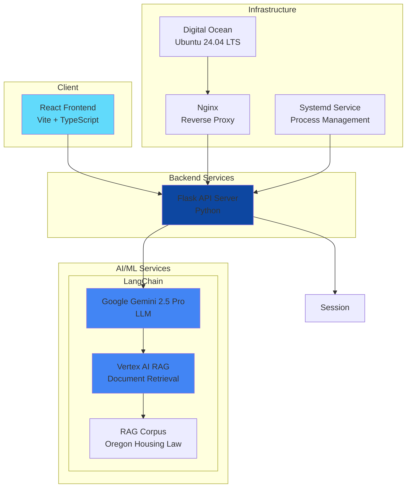
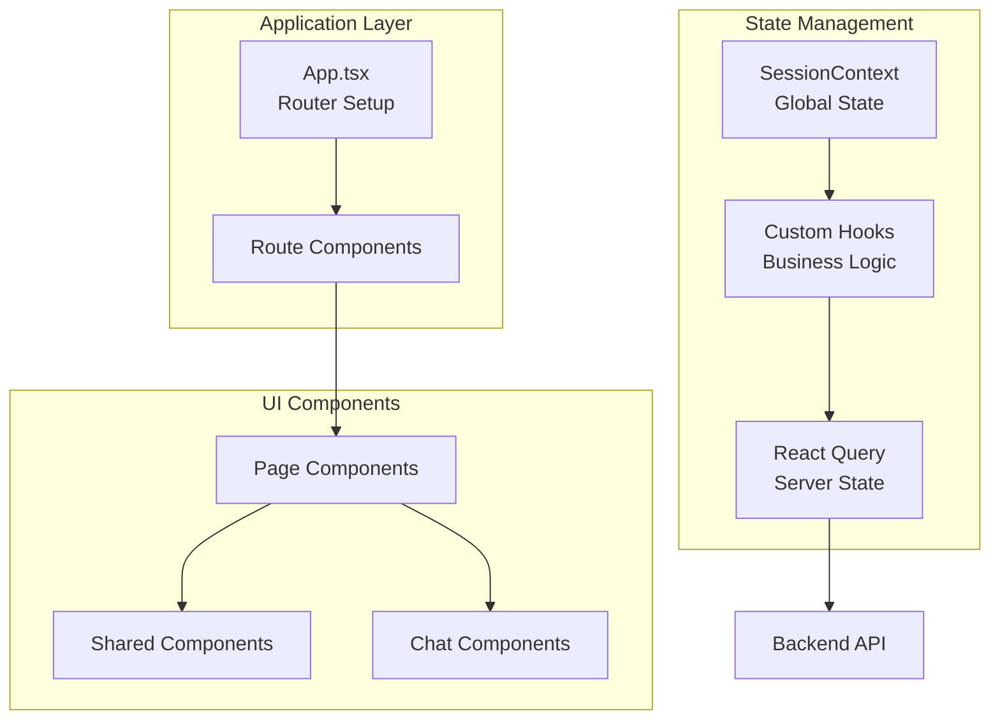

# Tenant First Aid - Architecture Documentation

## Overview

Tenant First Aid is a chatbot application that provides legal information related to housing and eviction in Oregon. The system uses a Retrieval-Augmented Generation (RAG) architecture to provide accurate, contextual responses based on Oregon housing law documents.  The LangChain framework is used to abstract models and agents.

The application follows a modern web architecture with a Flask-based Python backend serving a React frontend, deployed on Digital Ocean infrastructure.



## Backend

The backend documentation now lives in the **Backend Guide**, built with
[Great Docs](https://posit-dev.github.io/great-docs/). The narrative source is in
[backend/user_guide/](backend/user_guide/), and the symbol-level API reference
(classes, functions, and signatures) is generated from the code's docstrings into
the same site. Build both with `mise run docs` from `backend/`, then open
`backend/great-docs/_site/index.html`.

The guide is organized into short, topic-scoped chapters with audience-oriented
reading paths (new reader, backend contributor, corpus operator):

**Architecture**

- System Overview
- Backend Overview — package layout, endpoints, technology stack
- RAG & Document Retrieval — agent, tools, entry points, query pipeline
- Streaming Responses — response chunk types and stream mechanics
- Conversation Management — multi-turn state and location context

**Operations**

- Configuration & Logging — environment variables and log setup
- Corpus Ingestion — how documents become a Vertex AI Search datastore
- Command Reference — every `mise run` task

## Frontend

### Overview

The frontend is a modern React application built with TypeScript and Vite. It provides a clean, accessible chat interface for users to interact with the legal advice chatbot.

### Directory/File Structure

```
frontend/
├── src/
│   ├── App.tsx                     # Main application component with routing logic
│   ├── Chat.tsx                    # Chat page component
│   ├── Letter.tsx                  # Letter page component
│   ├── About.tsx                   # About page
│   ├── Disclaimer.tsx              # Legal disclaimer
│   ├── PrivacyPolicy.tsx           # Privacy policy
│   ├── Referrals.tsx               # Static referrals table (legal aid organizations)
│   ├── main.tsx                    # Application entry point
│   ├── style.css                   # Global styles
│   ├── contexts/                   # React Contexts
│   │   └── HousingContext.tsx      # Housing context for chat/letter generation
│   ├── hooks/                      # Custom React hooks
│   │   ├── useIsMobile.tsx         # Checking mobile state
│   │   ├── useMessages.tsx         # Message handling logic
│   │   ├── useHousingContext.tsx   # Custom hook for housing context
│   │   └── useLetterContent.tsx    # State management for letter generation
│   ├── types/                      # Auto-generated TypeScript types (gitignored) — do not edit manually, re-run `mise run generate-types` or `npm run generate-types`
│   │   └── models.ts                  # All exported types: ResponseChunk, Location, OregonCity, UsaState, chunk interfaces
│   ├── layouts/                    # Layouts
│   │   └── PageLayout.tsx          # Layout for pages
│   ├── pages/
│   │   ├── Chat/                   # Chat page components
│   │   │   ├── components/
│   │   │   │   ├── ChatDisclaimer.tsx # Disclaimer for Chat page
│   │   │   │   ├── InitializationForm.tsx # Context information from user
│   │   │   │   ├── ExportMessagesButton.tsx # Chat export
│   │   │   │   ├── InputField.tsx      # Message input
│   │   │   │   ├── FeedbackModal.tsx   # Feedback modal
│   │   │   │   ├── MessageContent.tsx  # Message display
│   │   │   │   └── MessageWindow.tsx   # Chat window
│   │   │   └── utils/
│   │   │       ├── exportHelper.ts     # Export functionality
│   │   │       ├── feedbackHelper.ts   # Feedback functionality
│   │   │       └── streamHelper.ts     # Stream functionality
│   │   ├──Letter/               # Letter page components
│   │   │   ├── components/
│   │   │   │   ├── LetterDisclaimer.tsx # Disclaimer for Letter page
│   │   │   │   └── LetterGenerationDialog.tsx # Letter page dialog
│   │   │   └── utils/
│   │   │       └── letterHelper.ts     # Letter generation functionality
│   │   └── LoadingPage.tsx             # Loading component for routes
│   ├── shared/                     # Shared components and utils
│   │   ├── types/
│   │   │   └── messages.ts         # Frontend shared types for messages
│   │   ├── components/
│   │   │   ├── Navbar/
│   │   │   │   ├── Sidebar.tsx     # Navigation for mobile
│   │   │   │   ├── Navbar.tsx      # Navigation
│   │   │   │   └── NavbarMenuButton.tsx # Navigation component
│   │   │   ├── BackLink.tsx        # Navigation component
│   │   │   ├── BeaverIcon.tsx      # Oregon-themed icon
│   │   │   ├── DisclaimerLayout.tsx  # Layout for disclaimer components
│   │   │   ├── FeatureSnippet.tsx  # Features and references component
│   │   │   ├── FeaturesPanel.tsx   # Collapsible Features sidebar
│   │   │   ├── MessageContainer.tsx  # Layout for main UI component
│   │   │   ├── PageSection.tsx     # Layout static page sections component
│   │   │   ├── SafeMarkdown.tsx    # Safe markdown renderer
│   │   │   └── TenantFirstAidLogo.tsx # Application logo
│   │   ├── constants/
│   │   │   └── constants.ts        # File of constants
│   │   └── utils/
│   │       ├── buildLocationPrefix.ts # Helper function for location prefix
│   │       ├── scrolling.ts        # Helper function for window scrolling
│   │       ├── dompurify.ts        # Helper function for sanitizing text
│   │       └── formatLocation.ts   # Formats OregonCity/UsaState into a display string (e.g. "Portland, OR")
│   └── tests/                     # Testing suite
│   │   ├── components/            # Component testing
│   │   │   ├── About.test.tsx     # About component testing
│   │   │   ├── FeaturesPanel.test.tsx # FeaturesPanel toggle testing
│   │   │   ├── ChatDisclaimer.test.tsx # ChatDisclaimer component testing
│   │   │   ├── HousingContext.test.tsx # HousingContext component testing
│   │   │   ├── InitializationForm.test.tsx # InitializationForm component testing
│   │   │   ├── Letter.test.tsx    # Letter component testing
│   │   │   ├── LetterDisclaimer.test.tsx # LetterDisclaimer component testing
│   │   │   ├── LoadingPage.test.tsx # LoadingPage component testing
│   │   │   ├── MessageContainer.test.tsx # MessageContainer component testing
│   │   │   ├── MessageContent.test.tsx # MessageContent component testing
│   │   │   ├── MessageWindow.test.tsx # MessageWindow component testing
│   │   │   ├── PageLayout.test.tsx # PageLayout component testing
│   │   │   └── PageSection.test.tsx # PageSection component testing
│   │   ├── hooks/                 # Hook testing
│   │   │   ├── useLetterContent.test.tsx # useLetterContent testing
│   │   │   └── useMessages.test.ts # useMessages testing
│   │   └── utils/                  # Utility function testing
│   │       ├── dompurify.test.ts   # dompurify testing
│   │       ├── exportHelper.test.ts # exportHelper testing
│   │       ├── feedbackHelper.test.ts # feedbackHelper testing
│   │       ├── letterHelper.test.ts # letterHelper testing
│   │       ├── sanitizeText.test.ts # sanitizeText testing
│   │       ├── streamHelper.test.ts # streamHelper testing
│   │       └── formatLocation.test.ts # formatLocation testing
├── public/
│   └── favicon.svg                 # Site favicon
├── package.json                    # Dependencies and scripts
├── vite.config.ts                  # Vite configuration
├── vitest.config.ts                # Vitest configuration
├── tsconfig.json                   # TypeScript configuration
└── eslint.config.js                # ESLint configuration
```

### Framework

**Core Technologies:**

- **React 19.0.0**: Component-based UI library
- **TypeScript 5.7.2**: Type-safe JavaScript
- **Vite 6.3.1**: Fast build tool and dev server
- **Tailwind CSS 4.1.6**: Utility-first CSS framework

**State Management:**

- **React Query (@tanstack/react-query)**: Server state management
- **React Router DOM**: Client-side routing
- **React Context**: Application-wide state

**Frontend Architecture:**



## Deployment

For full deployment documentation — environments, CI/CD pipeline, secrets management, debugging, permissions, and observability — see [Deployment.md](Deployment.md).
