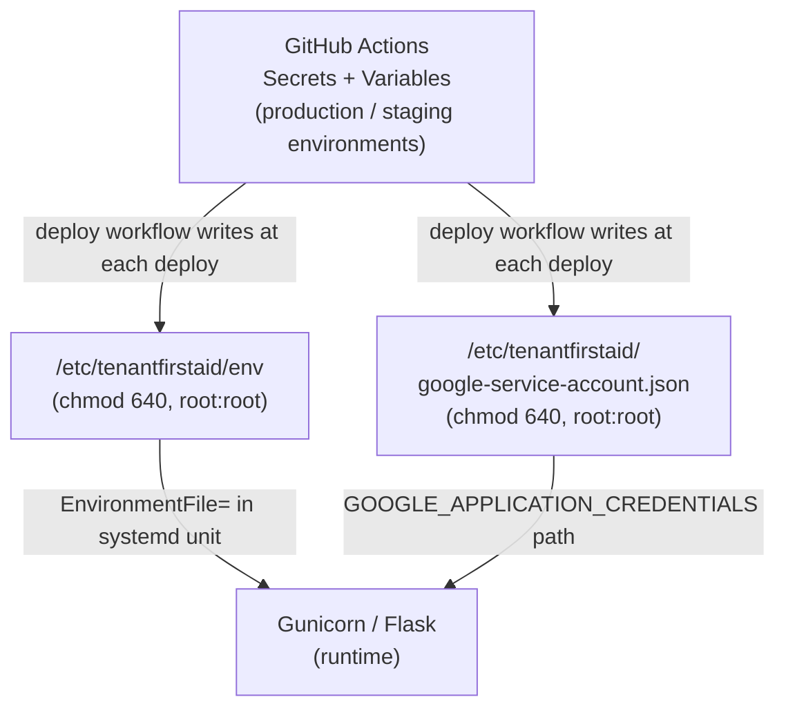

# Deployment

This document covers how Tenant First Aid is deployed, where it runs, how configuration and secrets are managed, how to debug issues, who has access, and how the service is monitored.

> **Not a developer?** Start with [Overview for stakeholders](#overview-for-stakeholders). The rest of the document is aimed at contributors and operators.

---

## Overview for stakeholders

Tenant First Aid runs as a public website at [tenantfirstaid.com](https://tenantfirstaid.com). "Deployment" is the process of taking code changes written by volunteers and making them live for users.

```mermaid
flowchart TD
    Dev["👩‍💻 Developer<br/>writes code"] -->|"opens pull request"| Review["👥 Code review<br/>& automated tests"]
    Review -->|"approved and merged"| Build["🔨 GitHub Actions<br/>builds the app"]
    Build -->|"copies files to server"| Server["🖥️ Digital Ocean<br/>server"]
    Server -->|"serves the website"| User["🏠 Tenant<br/>visits the site"]
```



**Key points for stakeholders:**

- **Who manages deployments?** Project admins at [Code for PDX](https://codeforpdx.org/) control the server and deployment pipeline. See [Permissions](#permissions) to request access.
- **Where does it run?** A single server ("droplet") hosted on [Digital Ocean](https://www.digitalocean.com/), a cloud provider. It serves both the website UI and the AI-powered backend.
- **How often does it deploy?** Every time a change is merged into the `main` branch, the site updates automatically within a few minutes.
- **Is there a staging environment?** Yes — a separate server mirrors production and is used for testing changes before they reach users. It is triggered manually by a maintainer.
- **What AI service powers the chatbot?** Google's Gemini 2.5 Pro model via Google Cloud (Vertex AI), not the server itself.

---

## Environments

| Environment | URL | Deployment trigger | Purpose |
|-------------|-----|--------------------|---------|
| **Production** | [tenantfirstaid.com](https://tenantfirstaid.com) | Automatic on push to `main` | Live site for end users |
| **Staging** | Internal URL (see GitHub environment settings) | Manual (`workflow_dispatch`) | Pre-production validation |
| **Local** | `http://localhost:5173` | Manual (`uv run python -m tenantfirstaid.app` + `npm run dev`) | Developer iteration and testing |

Both production and staging have independent sets of secrets and variables managed in GitHub Actions [environment settings](https://github.com/codeforpdx/tenantfirstaid/settings/environments). This means staging can be pointed at a different server or datastore without affecting production.

For local development setup, see the [Quick Start in README.md](README.md#quick-start). The local environment reads credentials from `backend/.env` (git-ignored) and connects to the same Google Cloud services as production by default, using developer-scoped GCP credentials.

Notable staging-only setting: `SHOW_MODEL_THINKING` can be toggled on to surface the model's internal reasoning steps for debugging purposes.

---

## Deployment principles

- **Reproducibility**: Python dependencies are pinned in `backend/uv.lock`; Node dependencies are pinned in `frontend/package-lock.json`. The same commit always produces the same build.
- **No secrets in code**: secrets are never committed to the repository. They are stored encrypted in GitHub Actions environments and written to the server at deploy time (see [Secrets and configuration](#secrets-and-configuration)).
- **Continuous delivery**: every merge to `main` automatically triggers a production deploy via GitHub Actions with no manual steps.
- **Single concurrency**: the `deploy-to-droplet` concurrency group ensures only one deploy runs at a time; a newer push cancels an in-progress deploy.
- **Supply-chain security**: all third-party GitHub Actions are pinned to commit SHAs rather than floating version tags. See [CLAUDE.md](.claude/CLAUDE.md) for the pinning policy.
- **Configuration as code**: server configuration files (Nginx, systemd) are version-controlled in `config/`. See [Server configuration](#server-configuration) for the caveat on syncing them.
- **External artifact immutability**: production external artifacts must not be modified in-place while in use. Follow a copy → modify → update-deployment pattern: create a new artifact version, validate it in staging, then update the relevant environment variable and redeploy. See [External artifact lifecycle](#external-artifact-lifecycle) for the full policy by artifact type.

### External artifact lifecycle

"External artifacts" are resources that live outside the application code and are referenced by environment variable at runtime — most importantly the Vertex AI RAG corpus, but also cloud storage objects and any future database.

#### Artifact types and immutability trigger

| Artifact type | Current example | Becomes immutable when… |
|---------------|-----------------|-------------------------|
| **Vertex AI RAG corpus** (data store) | `VERTEX_AI_DATASTORE` | Deployed to any live environment (staging or production) |
| **Cloud storage objects** (GCS files, etc.) | — (not currently used) | Deployed and referenced by a running service |
| **Database** (relational / document) | — (not currently used) | Tables / collections referenced by a live deployment |

Once immutable, an artifact **must never be mutated in-place**. The risk is that an in-flight request, a rollback, or a concurrent staging run would then see an inconsistent or corrupted view of the data.

#### Lifecycle for the Vertex AI RAG corpus

```mermaid
flowchart TD
    A["Create new corpus version<br/>(backend/scripts/create_vector_store.py)"] --> B["Point staging to new corpus<br/>(update VERTEX_AI_DATASTORE in staging env)"]
    B --> C["Deploy to staging and validate<br/>(smoke-test the chatbot)"]
    C --> D{"Validation passed?"}
    D -->|No| E["Debug / iterate on corpus<br/>(new corpus is still mutable)"]
    E --> C
    D -->|Yes| F["Point production to new corpus<br/>(update VERTEX_AI_DATASTORE in production env)"]
    F --> G["Deploy to production<br/>(corpus is now immutable)"]
    G --> H["Archive old corpus ID<br/>(keep for rollback window)"]
    H --> I{"Rollback needed?"}
    I -->|Yes| J["Revert VERTEX_AI_DATASTORE<br/>to previous corpus ID, redeploy"]
    I -->|No — stable for ≥1 sprint| K["Safe to delete old corpus"]
```



**Rules:**
- A corpus is **mutable** until it is first deployed to any live environment.
- Once deployed, it is **immutable** — never add, remove, or reindex documents in that corpus.
- To update the knowledge base, always create a **new corpus** via `create_vector_store.py`.
- The old corpus must be **retained** for at least one sprint (or until the next successful deployment) to support rollback and bug reproduction.
- A corpus may be **deleted** only after: (1) it is no longer referenced by any environment, and (2) no open bugs require reproducing behavior against it.

#### Rollbacks

To roll back to a previous corpus:
1. In GitHub [environment settings](https://github.com/codeforpdx/tenantfirstaid/settings/environments), revert `VERTEX_AI_DATASTORE` to the previous corpus ID.
2. Trigger a production deploy (push a revert commit or use `workflow_dispatch`).
3. Verify the site is serving correct answers.
4. Post a note in `#tenantfirstaid-general` on Discord describing the rollback and the reason.

Code rollbacks (reverting a bad commit) follow the same deploy-on-merge pattern; no special steps are needed beyond creating and merging a revert PR.

#### Bug reproduction

When reproducing a production bug:
1. Use the staging environment, pointed at the same corpus ID that was active in production at the time of the bug.
2. Never delete a corpus while a bug referencing it is still open.
3. If the bug is in the LLM's behavior (not the corpus), use LangSmith traces from the time of the incident.

#### Future artifact types (database, cloud storage)

No database or persistent cloud storage is currently used in production. When introduced, apply the same principle: create a versioned snapshot or migration, validate in staging, promote to production, retain the previous state through the rollback window.

---

## Infrastructure

The application runs on a single Digital Ocean Droplet:

| Property | Value |
|----------|-------|
| Provider | [Digital Ocean](https://www.digitalocean.com/) |
| OS | Ubuntu LTS 24.04 |
| CPUs | 2 |
| RAM | 2 GB |
| Domain registrar / DNS | [Porkbun](https://porkbun.com/) — `tenantfirstaid.com` |
| TLS certificates | [Let's Encrypt](https://letsencrypt.org/) via Certbot (auto-renewing) |


### Nginx

Nginx (config: [`config/tenantfirstaid.conf`](config/tenantfirstaid.conf)) does two things:

1. **Serves static files**: the built React frontend (`frontend/dist/`) is served directly from disk, with a fallback to `index.html` for client-side routing.
2. **Proxies API requests**: requests to `/api/` are forwarded to Gunicorn via a Unix domain socket (no TCP overhead).

All HTTP traffic is redirected to HTTPS. TLS is managed by Certbot.

### Gunicorn + systemd

The Flask backend runs under Gunicorn with 10 worker processes and a 300-second timeout (config: [`config/tenantfirstaid-backend.service`](config/tenantfirstaid-backend.service)). Systemd restarts the process on failure and ensures it starts on server reboot.

---

## CI/CD pipeline

```mermaid
flowchart TD
    Trigger["Push to main (production)<br/>or manual trigger (staging)"] --> Checkout["Checkout source code"]
    Checkout --> NodeSetup["Set up Node 20<br/>(cached)"]
    NodeSetup --> BuildUI["Build React frontend<br/>npm ci && npm run build"]
    BuildUI --> SCPBackend["Upload backend/ to droplet via SCP<br/>(replaces existing directory)"]
    SCPBackend --> SCPFrontend["Upload frontend/dist to droplet via SCP<br/>(appends — does not replace backend)"]
    SCPFrontend --> UVInstall["SSH: install uv on droplet<br/>(skip if already present)"]
    UVInstall --> UVSync["SSH: uv sync<br/>(install / update Python deps from lockfile)"]
    UVSync --> WriteEnv["SSH: write /etc/tenantfirstaid/env<br/>(inject GitHub secrets as env vars)"]
    WriteEnv --> WriteCreds["SSH: write /etc/tenantfirstaid/google-service-account.json<br/>(GCP service account)"]
    WriteCreds --> Restart["SSH: systemctl restart tenantfirstaid-backend<br/>+ systemctl reload nginx"]
```



**Workflow files:**

- Production: [`.github/workflows/deploy.production.yml`](.github/workflows/deploy.production.yml) — triggers on every push to `main`.
- Staging: [`.github/workflows/deploy.staging.yml`](.github/workflows/deploy.staging.yml) — triggered manually via `workflow_dispatch` in the GitHub Actions UI.

The two workflows are structurally identical; the only difference is which GitHub Actions environment (`production` vs `staging`) they read credentials from.

> **Nginx config and systemd service are not auto-deployed.** The files in `config/` are version-controlled here for reference, but the CI pipeline does not copy them to the server. Changes to Nginx or systemd configuration require a manual step by a server admin (see [Manual server configuration changes](#manual-server-configuration-changes)).

---

## Secrets and configuration

### Where secrets live



Secrets exist in two places:

1. **GitHub Actions environments** — managed in [repository settings → Environments](https://github.com/codeforpdx/tenantfirstaid/settings/environments). Requires maintainer access to view or edit. Each deploy rewrites the on-server files from these values.
2. **On the server** — `/etc/tenantfirstaid/` holds the env file and GCP credentials JSON. The directory is restricted to root (750). The files within are readable by root and the group (640). Between deploys these files persist on disk; a new deploy always overwrites them.

### GitHub Actions secrets (sensitive)

> **⚠️ Potentially obsolete** items are flagged — they appear in the deploy workflow env file but have no corresponding `os.getenv()` call in the application source. They may be vestigial from a previous design; a maintainer should confirm before removing.

| Secret | Purpose | Referenced in |
|--------|---------|---------------|
| `SSH_KEY` | Private key for SSH / SCP access to the droplet | [deploy.production.yml](.github/workflows/deploy.production.yml), [deploy.staging.yml](.github/workflows/deploy.staging.yml) |
| `FLASK_SECRET_KEY` | ⚠️ Intended to sign Flask session cookies — **not read by any current application code**; Flask does not automatically pick this up from the environment | [deploy.production.yml](.github/workflows/deploy.production.yml) (env file only) |
| `GOOGLE_SERVICE_ACCOUNT_CREDENTIALS` | GCP service account JSON; grants access to Vertex AI (Gemini + RAG). Also used in PR checks for non-fork PRs | [deploy.production.yml](.github/workflows/deploy.production.yml), [deploy.staging.yml](.github/workflows/deploy.staging.yml), [pr-check.yml](.github/workflows/pr-check.yml) |
| `DB_HOST` | ⚠️ Database host address — **not read by any current application code**; no database layer exists in the backend | [deploy.production.yml](.github/workflows/deploy.production.yml) (env file only) |
| `DB_PASSWORD` | ⚠️ Database password — **not read by any current application code** | [deploy.production.yml](.github/workflows/deploy.production.yml) (env file only) |
| `APP_PASSWORD` | SMTP app-specific password for sending feedback emails | [deploy.production.yml](.github/workflows/deploy.production.yml), [backend/tenantfirstaid/app.py](backend/tenantfirstaid/app.py) |
| `SSH_USER` | SSH username on the droplet (staging environment only — stored as a secret there) | [deploy.staging.yml](.github/workflows/deploy.staging.yml) |

### GitHub Actions variables (non-sensitive)

| Variable | Purpose | Referenced in |
|----------|---------|---------------|
| `URL` | Droplet hostname or IP address | [deploy.production.yml](.github/workflows/deploy.production.yml), [deploy.staging.yml](.github/workflows/deploy.staging.yml) |
| `SSH_USER` | SSH username on the droplet (production — stored as a plain variable) | [deploy.production.yml](.github/workflows/deploy.production.yml) |
| `FRONTEND_DIR` | Path to `frontend/` within the repository | [deploy.production.yml](.github/workflows/deploy.production.yml), [deploy.staging.yml](.github/workflows/deploy.staging.yml) |
| `BACKEND_DIR` | Path to `backend/` within the repository | [deploy.production.yml](.github/workflows/deploy.production.yml), [deploy.staging.yml](.github/workflows/deploy.staging.yml) |
| `REMOTE_APP_DIR` | Deployment root on the server (e.g. `/var/www/tenantfirstaid`) | [deploy.production.yml](.github/workflows/deploy.production.yml), [deploy.staging.yml](.github/workflows/deploy.staging.yml) |
| `SERVICE_NAME` | Systemd service name (e.g. `tenantfirstaid-backend`) | [deploy.production.yml](.github/workflows/deploy.production.yml), [deploy.staging.yml](.github/workflows/deploy.staging.yml) |
| `ENV` | Runtime environment label (`prod` / `staging`) | [deploy.production.yml](.github/workflows/deploy.production.yml), [backend/tenantfirstaid/app.py](backend/tenantfirstaid/app.py) |
| `DB_PORT` | ⚠️ Database port — **not read by any current application code** | [deploy.production.yml](.github/workflows/deploy.production.yml) (env file only) |
| `MAIL_PORT` | SMTP port | [deploy.production.yml](.github/workflows/deploy.production.yml), [backend/tenantfirstaid/app.py](backend/tenantfirstaid/app.py) |
| `MAIL_SERVER` | SMTP server hostname | [deploy.production.yml](.github/workflows/deploy.production.yml), [backend/tenantfirstaid/app.py](backend/tenantfirstaid/app.py) |
| `SENDER_EMAIL` | Sender address for feedback emails | [deploy.production.yml](.github/workflows/deploy.production.yml), [backend/tenantfirstaid/app.py](backend/tenantfirstaid/app.py), [backend/tenantfirstaid/feedback.py](backend/tenantfirstaid/feedback.py) |
| `RECIPIENT_EMAIL` | Recipient address for feedback emails | [deploy.production.yml](.github/workflows/deploy.production.yml), [backend/tenantfirstaid/feedback.py](backend/tenantfirstaid/feedback.py) |
| `MODEL_NAME` | Gemini model identifier (e.g. `gemini-2.5-pro`) | [deploy.production.yml](.github/workflows/deploy.production.yml), [backend/tenantfirstaid/constants.py](backend/tenantfirstaid/constants.py) |
| `GOOGLE_CLOUD_PROJECT` | GCP project ID | [deploy.production.yml](.github/workflows/deploy.production.yml), [backend/tenantfirstaid/constants.py](backend/tenantfirstaid/constants.py), [pr-check.yml](.github/workflows/pr-check.yml) |
| `GOOGLE_CLOUD_LOCATION` | GCP region (e.g. `global`) | [deploy.production.yml](.github/workflows/deploy.production.yml), [backend/tenantfirstaid/constants.py](backend/tenantfirstaid/constants.py) |
| `VERTEX_AI_DATASTORE` | Vertex AI RAG corpus identifier | [deploy.production.yml](.github/workflows/deploy.production.yml), [backend/tenantfirstaid/constants.py](backend/tenantfirstaid/constants.py) |
| `SHOW_MODEL_THINKING` | Toggle Gemini reasoning display (staging only; hardcoded `false` in production) | [deploy.staging.yml](.github/workflows/deploy.staging.yml), [backend/tenantfirstaid/constants.py](backend/tenantfirstaid/constants.py) |

### Local development

Copy `backend/.env.example` to `backend/.env` and fill in the required values. See [README.md](README.md#prerequisites) for step-by-step instructions. The `.env` file is git-ignored and never committed. The variables in `.env.example` mirror the production configuration but use developer-specific credentials.

---

## Server configuration

The [`config/`](config/) directory contains reference copies of the two server configuration files:

| File | Deployed to | Managed by |
|------|-------------|------------|
| [`config/tenantfirstaid.conf`](config/tenantfirstaid.conf) | `/etc/nginx/sites-available/tenantfirstaid` | Manual — server admin |
| [`config/tenantfirstaid-backend.service`](config/tenantfirstaid-backend.service) | `/etc/systemd/system/tenantfirstaid-backend.service` | Manual — server admin |

> **These files are not auto-deployed.** The CI pipeline only deploys application code. If you change a config file in this repository, a server admin must manually copy it to the server and reload the relevant service.

### Manual server configuration changes

For Nginx config changes:

```bash
sudo cp /path/to/tenantfirstaid.conf /etc/nginx/sites-available/tenantfirstaid
sudo nginx -t               # Validate config before reloading.
sudo systemctl reload nginx
```

For systemd service changes:

```bash
sudo cp /path/to/tenantfirstaid-backend.service /etc/systemd/system/
sudo systemctl daemon-reload
sudo systemctl restart tenantfirstaid-backend
```

---

## Debugging

### Accessing the droplet

Server admins access the droplet via the **Digital Ocean web console** — no local SSH setup required:

1. Log in to the [Digital Ocean control panel](https://cloud.digitalocean.com/).
2. Navigate to **Droplets** and select the `tenantfirstaid` droplet.
3. Click **Console** (top right of the droplet detail page) to open a browser-based terminal session.

If you need server access for the first time, see [Permissions](#permissions) to request a Digital Ocean team invite.

### Using observability to narrow down the issue

Before running commands on the server, use available signals to identify the affected layer:

1. **Check the GitHub Actions deploy log first.** Open the [Actions tab](https://github.com/codeforpdx/tenantfirstaid/actions) and look at the most recent deploy run. A failed step there means the issue is in the deploy pipeline, not the running application.

2. **Check DataDog** (if you have access). The production backend ships structured logs with trace injection enabled (`DD_LOGS_INJECTION=true`). Filter by `service:tenant-first-aid` and `env:prod`. Look for:
   - HTTP 5xx errors → likely Gunicorn / Flask issue
   - Timeout patterns → check Gunicorn worker count or GCP API latency
   - Crash loops (repeated startup logs) → missing or malformed env vars

3. **Check the Nginx access log** for HTTP status codes if the DataDog agent is not forwarding logs (see [View logs](#view-logs) below). A 502 means Gunicorn is not running; a 504 means it is running but timing out.

4. **Check application logs via journalctl** (requires droplet console access) to see Python tracebacks and startup errors.

Once you have a hypothesis, use the commands in the sections below to confirm and fix it.

### Check service status

```bash
sudo systemctl status tenantfirstaid-backend
```

### View logs

```bash
# Live-tail application logs.
sudo journalctl -u tenantfirstaid-backend -f

# Last 200 lines.
sudo journalctl -u tenantfirstaid-backend -n 200

# Nginx access and error logs.
sudo tail -f /var/log/nginx/access.log
sudo tail -f /var/log/nginx/error.log
```

### Restart services

```bash
sudo systemctl restart tenantfirstaid-backend
sudo systemctl reload nginx
```

### Inspect the deployed environment file

```bash
sudo cat /etc/tenantfirstaid/env
```

### Check a failed deploy

Open the [GitHub Actions tab](https://github.com/codeforpdx/tenantfirstaid/actions) and select the failing workflow run. Each step's output is visible in the run log.

### SRE Runbooks

Each runbook follows **Detect → Diagnose → Resolve → Notify** steps.

> **Discord**: post all incident notifications and resolution confirmations in `#tenantfirstaid-general` on the [Code for PDX Discord](https://discord.gg/codeforpdx).

---

#### Runbook: Site down / 502 Bad Gateway

**Symptoms**: users see a 502 error; Nginx access log shows `502` responses on `/api/` routes.

**Detect**:
- Check [tenantfirstaid.com](https://tenantfirstaid.com) — if the frontend loads but the chatbot fails, the backend is down.
- Check the most recent GitHub Actions deploy run for errors.

**Diagnose**:
```bash
sudo systemctl status tenantfirstaid-backend
sudo journalctl -u tenantfirstaid-backend -n 50
```
Look for: crash on startup (missing env var), OOM kill, or permission error on the socket.

**Resolve**:
```bash
# Restart the backend service.
sudo systemctl restart tenantfirstaid-backend
sudo systemctl status tenantfirstaid-backend   # Confirm it is active (running).
```
If it won't start, check `/etc/tenantfirstaid/env` for missing or malformed variables. Trigger a fresh deploy to rewrite the env file if needed.

**Notify**: Post in `#tenantfirstaid-general`:
> ⚠️ **Incident**: backend down (502). Restarted tenantfirstaid-backend at [time]. Monitoring for stability. Root cause: [brief description].

---

#### Runbook: Gemini API errors

**Symptoms**: chatbot returns an error message or hangs; journalctl shows `google.api_core.exceptions` tracebacks.

**Common error classes**:

| Error | Likely cause | Action |
|-------|-------------|--------|
| `ResourceExhausted` / 429 | Quota exceeded | Wait for quota reset (check [GCP console quotas](https://console.cloud.google.com/iam-admin/quotas)); request quota increase if recurring |
| `PermissionDenied` / 403 | Service account lacks Vertex AI role, or credentials file is stale | Re-deploy (rewrites credentials file); verify service account roles in GCP IAM |
| `Unauthenticated` / 401 | Service account key expired or malformed | Re-deploy; if still failing, rotate the `GOOGLE_SERVICE_ACCOUNT_CREDENTIALS` secret and re-deploy |
| `ServiceUnavailable` / 503 | GCP regional outage | Check [Google Cloud Status](https://status.cloud.google.com/); no action until outage clears |
| `InvalidArgument` / 400 | Model name changed or unsupported | Check `MODEL_NAME` variable in GitHub environment settings against the [Gemini model list](https://cloud.google.com/vertex-ai/generative-ai/docs/learn/models) |

**Diagnose**:
```bash
sudo journalctl -u tenantfirstaid-backend -n 100 | grep -i "exception\|error\|google"
sudo cat /etc/tenantfirstaid/env | grep -E "MODEL_NAME|GOOGLE_CLOUD|VERTEX"
```

**Resolve**: apply the action from the table above. For quota issues, consider temporarily disabling the chatbot route in Nginx while waiting.

**Notify**: Post in `#tenantfirstaid-general`:
> ⚠️ **Incident**: Gemini API errors ([error class]). Status: [investigating / resolved]. Impact: chatbot unavailable / degraded. ETA: [if known].

---

#### Runbook: Vertex AI RAG errors

**Symptoms**: chatbot responds without legal citations, or journalctl shows `VertexAI` / `datastore` errors.

**Diagnose**:
```bash
sudo journalctl -u tenantfirstaid-backend -n 100 | grep -i "retriev\|datastore\|rag\|vertex"
sudo cat /etc/tenantfirstaid/env | grep VERTEX_AI_DATASTORE
```
Verify the corpus ID in the env file matches an existing corpus in [GCP Vertex AI Search](https://console.cloud.google.com/gen-app-builder/data-stores).

**Common causes**:

| Symptom | Cause | Fix |
|---------|-------|-----|
| `NOT_FOUND` on datastore ID | Corpus deleted or wrong ID | Update `VERTEX_AI_DATASTORE` in GitHub environment settings and redeploy |
| Empty retrieval results | Corpus not indexed / wrong metadata filters | Re-ingest documents via `backend/scripts/create_vector_store.py`; follow [External artifact lifecycle](#external-artifact-lifecycle) |
| Auth errors on RAG calls | Same as Gemini auth issues | See Gemini runbook above |

**Resolve**: update the `VERTEX_AI_DATASTORE` environment variable to a valid corpus ID and trigger a redeploy.

**Notify**: Post in `#tenantfirstaid-general`:
> ⚠️ **Incident**: RAG retrieval errors — chatbot may respond without citations. Status: [investigating / resolved]. Corpus ID in use: [value from env].

---

#### Runbook: TLS certificate expiry

**Symptoms**: browsers show a certificate error; `curl -I https://tenantfirstaid.com` returns an SSL handshake error.

**Diagnose**:
```bash
sudo certbot certificates          # Show expiry dates.
sudo systemctl status certbot.timer  # Check the auto-renewal timer is active.
sudo journalctl -u certbot -n 50   # Look for renewal errors.
```

**Resolve**:
```bash
sudo certbot renew --dry-run       # Test renewal without committing.
sudo certbot renew                 # Renew all certificates.
sudo systemctl reload nginx        # Reload Nginx to pick up new certs.
```
If the timer is disabled: `sudo systemctl enable --now certbot.timer`.

**Notify**: Post in `#tenantfirstaid-general`:
> ⚠️ **Incident**: TLS certificate expired / near expiry. Renewed at [time]. Next expiry: [date from certbot certificates].

---

#### Runbook: Failed deployment

**Symptoms**: GitHub Actions deploy run shows a red ✗; the site may be on an older version or partially broken.

**Detect**: check the [Actions tab](https://github.com/codeforpdx/tenantfirstaid/actions) for the failing run and identify the failing step.

**Common failure points**:

| Failing step | Likely cause | Fix |
|-------------|-------------|-----|
| **Build UI** | npm dependency or build error | Fix in code; re-merge or trigger `workflow_dispatch` |
| **Upload via SCP** | Droplet unreachable or SSH key invalid | Check droplet status in Digital Ocean console; verify `SSH_KEY` secret is current |
| **uv sync** | Lockfile conflict or network error | Re-run the workflow; if persistent, check `uv.lock` in the repo |
| **Write env file** | Malformed secret value (newline in secret) | Edit the offending secret in GitHub environment settings |
| **systemctl restart** | Service unit file missing or broken | Manually apply `config/tenantfirstaid-backend.service` to the server |

**Resolve**: fix the root cause and re-trigger the deploy (push a fix commit, or use `workflow_dispatch` on the staging workflow).

**Notify**: Post in `#tenantfirstaid-general`:
> ⚠️ **Incident**: deploy failed at step "[step name]" — production may be on previous version. Fix in progress. PR/commit: [link].

---

### Common issues

| Symptom | Likely cause | Fix |
|---------|-------------|-----|
| 502 Bad Gateway | Gunicorn not running | See [Runbook: Site down / 502](#runbook-site-down--502-bad-gateway) |
| App starts then crashes | Missing or invalid env var | Check `/etc/tenantfirstaid/env`; look for the specific error in `journalctl` |
| GCP API errors | Bad or expired service account credentials | Re-deploy (the workflow rewrites the credentials file) |
| TLS certificate expiry | Certbot renewal failed | See [Runbook: TLS certificate expiry](#runbook-tls-certificate-expiry) |
| Deploy stuck / hanging | Previous deploy still running | Cancel it in the GitHub Actions UI; the concurrency group will allow the next one to proceed |
| Chatbot returns wrong answers | Stale or incorrect RAG corpus | Check `VERTEX_AI_DATASTORE` in the env file; see [External artifact lifecycle](#external-artifact-lifecycle) |

---

## Permissions

### Current access levels

| Role | Access |
|------|--------|
| **Server admin** | Digital Ocean team membership (web console access to the droplet); can restart services, view logs, edit config files, and manage GitHub Actions environment secrets |
| **GitHub maintainer** | Can trigger manual (staging) deploys and read the deploy workflow output; cannot view GitHub Actions secrets |
| **Contributor** | No direct server access; contributes via pull requests which deploy automatically on merge |

### How to request access

Access is managed through [Code for PDX](https://codeforpdx.org/):

1. Complete the [Code for PDX onboarding](https://www.codepdx.org/volunteer) and join the Discord server.
2. Post in `#tenantfirstaid-general` on Discord describing the access you need and why.
3. An existing admin will review the request and grant the appropriate level of access.

For Google Cloud (Vertex AI) access needed for local development, see [README.md](README.md#prerequisites).

---

## Metrics and observability

### DataDog (current)

The production Gunicorn service is instrumented with DataDog for log collection and correlation. The following variables are set in the systemd service unit ([`config/tenantfirstaid-backend.service`](config/tenantfirstaid-backend.service)):

| Variable | Value | Purpose |
|----------|-------|---------|
| `DD_SERVICE` | `tenant-first-aid` | Service identifier in DataDog |
| `DD_ENV` | `prod` | Environment tag |
| `DD_LOGS_INJECTION` | `true` | Injects trace IDs into log lines |
| `DD_LOGS_ENABLED` | `true` | Enables log forwarding to DataDog |

The DataDog agent and its API key are configured directly on the server by a server admin and are not stored in this repository or the CI pipeline.

### LangSmith (LLM traces — development / CI only)

[LangSmith](https://smith.langchain.com/) can optionally trace LLM calls for debugging and evaluation when a `LANGSMITH_API_KEY` is set. See `backend/.env.example` for the relevant variables. LangSmith tracing is **not** enabled in the production deployment.

For running evaluations, see [`backend/scripts/EVALUATION.md`](backend/scripts/EVALUATION.md).

### Future plans

See issues tagged [`observability`](https://github.com/codeforpdx/tenantfirstaid/labels/observability) for planned monitoring improvements.

---

## Related documents

- [Architecture.md](Architecture.md) — code organization and system design
- [README.md](README.md) — local development setup
- [`config/`](config/) — server configuration files (Nginx, systemd)
- [`.github/workflows/deploy.production.yml`](.github/workflows/deploy.production.yml) — production CI/CD workflow
- [`.github/workflows/deploy.staging.yml`](.github/workflows/deploy.staging.yml) — staging CI/CD workflow
- [`backend/scripts/EVALUATION.md`](backend/scripts/EVALUATION.md) — LLM evaluation with LangSmith
