# Deployment

This document covers how Tenant First Aid is deployed, where it runs, how configuration and secrets are managed, how to debug issues, who has access, and how the service is monitored.

> **Not a developer?** Start with [Overview for stakeholders](#overview-for-stakeholders). The rest of the document is aimed at contributors and operators.

---

## Overview for stakeholders

Tenant First Aid runs as a public website at [tenantfirstaid.com](https://tenantfirstaid.com). "Deployment" is the process of taking code changes written by volunteers and making them live for users.

```mermaid
flowchart LR
    Dev["👩‍💻 Developer\nwrites code"] -->|"opens pull request"| Review["👥 Code review\n& automated tests"]
    Review -->|"approved and merged"| Build["🔨 GitHub Actions\nbuilds the app"]
    Build -->|"copies files to server"| Server["🖥️ Digital Ocean\nserver"]
    Server -->|"serves the website"| User["🏠 Tenant\nvisits the site"]
```



**Key points for stakeholders:**

- **Who manages deployments?** Project admins at [Code for PDX](https://codeforpdx.org/) control the server and deployment pipeline. See [Permissions](#permissions) to request access.
- **Where does it run?** A single server ("droplet") hosted on [Digital Ocean](https://www.digitalocean.com/), a cloud provider. It serves both the website UI and the AI-powered backend.
- **How often does it deploy?** Every time a change is merged into the `main` branch, the site updates automatically within a few minutes.
- **Is there a staging environment?** Yes — a separate server mirrors production and is used for testing changes before they reach users. It is triggered manually by a maintainer.
- **What AI service powers the chatbot?** Google's Gemini 2.5 Pro model via Google Cloud (Vertex AI), not the server itself.

---

## Environments

| Environment | URL | Deployment trigger | Purpose |
|-------------|-----|--------------------|---------|
| **Production** | [tenantfirstaid.com](https://tenantfirstaid.com) | Automatic on push to `main` | Live site for end users |
| **Staging** | Internal URL (see GitHub environment settings) | Manual (`workflow_dispatch`) | Pre-production validation |

Both environments have independent sets of secrets and variables managed in GitHub Actions [environment settings](https://github.com/codeforpdx/tenantfirstaid/settings/environments). This means staging can be pointed at a different server or datastore without affecting production.

Notable staging-only setting: `SHOW_MODEL_THINKING` can be toggled on to surface the model's internal reasoning steps for debugging purposes.

---

## Deployment principles

- **Reproducibility**: Python dependencies are pinned in `backend/uv.lock`; Node dependencies are pinned in `frontend/package-lock.json`. The same commit always produces the same build.
- **No secrets in code**: secrets are never committed to the repository. They are stored encrypted in GitHub Actions environments and written to the server at deploy time (see [Secrets and configuration](#secrets-and-configuration)).
- **Continuous delivery**: every merge to `main` automatically triggers a production deploy via GitHub Actions with no manual steps.
- **Single concurrency**: the `deploy-to-droplet` concurrency group ensures only one deploy runs at a time; a newer push cancels an in-progress deploy.
- **Supply-chain security**: all third-party GitHub Actions are pinned to commit SHAs rather than floating version tags. See [CLAUDE.md](.claude/CLAUDE.md) for the pinning policy.
- **Configuration as code**: server configuration files (Nginx, systemd) are version-controlled in `config/`. See [Server configuration](#server-configuration) for the caveat on syncing them.

---

## Infrastructure

The application runs on a single Digital Ocean Droplet:

| Property | Value |
|----------|-------|
| Provider | [Digital Ocean](https://www.digitalocean.com/) |
| OS | Ubuntu LTS 24.04 |
| CPUs | 2 |
| RAM | 2 GB |
| Domain registrar / DNS | [Porkbun](https://porkbun.com/) — `tenantfirstaid.com` |
| TLS certificates | [Let's Encrypt](https://letsencrypt.org/) via Certbot (auto-renewing) |

```mermaid
graph TB
    subgraph "Internet"
        Users["🏠 Users"]
        Certbot["Let's Encrypt\n(TLS certs — auto-renews)"]
        Porkbun["Porkbun DNS\n(tenantfirstaid.com)"]
    end

    subgraph "Digital Ocean Droplet · Ubuntu 24.04 LTS"
        Nginx["Nginx\nReverse proxy + TLS\nPorts 443 / 80"]
        Systemd["Systemd\nProcess manager"]
        Gunicorn["Gunicorn WSGI\n10 workers · Unix socket"]
        Flask["Flask Application"]
        Config["/etc/tenantfirstaid/\nenv + credentials"]
    end

    subgraph "Google Cloud Platform"
        Gemini["Gemini 2.5 Pro\n(LLM)"]
        VertexRAG["Vertex AI RAG\n(document retrieval)"]
    end

    Users -->|HTTPS| Porkbun
    Porkbun -->|"resolves to droplet IP"| Nginx
    Certbot -.->|"renews certs"| Nginx
    Nginx -->|"static files from disk"| Users
    Nginx -->|"/api/ → Unix socket"| Gunicorn
    Systemd -->|"manages"| Gunicorn
    Gunicorn --> Flask
    Flask -->|"service account auth"| Gemini
    Gemini --> VertexRAG
    Config -.->|"env vars at startup"| Gunicorn
```



### Nginx

Nginx (config: [`config/tenantfirstaid.conf`](config/tenantfirstaid.conf)) does two things:

1. **Serves static files**: the built React frontend (`frontend/dist/`) is served directly from disk, with a fallback to `index.html` for client-side routing.
2. **Proxies API requests**: requests to `/api/` are forwarded to Gunicorn via a Unix domain socket (no TCP overhead).

All HTTP traffic is redirected to HTTPS. TLS is managed by Certbot.

### Gunicorn + systemd

The Flask backend runs under Gunicorn with 10 worker processes and a 300-second timeout (config: [`config/tenantfirstaid-backend.service`](config/tenantfirstaid-backend.service)). Systemd restarts the process on failure and ensures it starts on server reboot.

---

## CI/CD pipeline

```mermaid
flowchart TD
    Trigger["Push to main\n(production)\nor manual trigger\n(staging)"] --> Checkout["Checkout source code"]
    Checkout --> NodeSetup["Set up Node 20\n(cached)"]
    NodeSetup --> BuildUI["Build React frontend\nnpm ci && npm run build"]
    BuildUI --> SCPBackend["Upload backend/ to droplet via SCP\n(replaces existing directory)"]
    SCPBackend --> SCPFrontend["Upload frontend/dist to droplet via SCP\n(appends — does not replace backend)"]
    SCPFrontend --> UVInstall["SSH: install uv on droplet\n(skip if already present)"]
    UVInstall --> UVSync["SSH: uv sync\n(install / update Python deps from lockfile)"]
    UVSync --> WriteEnv["SSH: write /etc/tenantfirstaid/env\n(inject GitHub secrets as env vars)"]
    WriteEnv --> WriteCreds["SSH: write /etc/tenantfirstaid/google-service-account.json\n(GCP service account)"]
    WriteCreds --> Restart["SSH: systemctl restart tenantfirstaid-backend\n+ systemctl reload nginx"]
```



**Workflow files:**

- Production: [`.github/workflows/deploy.production.yml`](.github/workflows/deploy.production.yml) — triggers on every push to `main`.
- Staging: [`.github/workflows/deploy.staging.yml`](.github/workflows/deploy.staging.yml) — triggered manually via `workflow_dispatch` in the GitHub Actions UI.

The two workflows are structurally identical; the only difference is which GitHub Actions environment (`production` vs `staging`) they read credentials from.

> **Nginx config and systemd service are not auto-deployed.** The files in `config/` are version-controlled here for reference, but the CI pipeline does not copy them to the server. Changes to Nginx or systemd configuration require a manual step by a server admin (see [Manual server configuration changes](#manual-server-configuration-changes)).

---

## Secrets and configuration

### Where secrets live


Secrets exist in two places:

1. **GitHub Actions environments** — managed in [repository settings → Environments](https://github.com/codeforpdx/tenantfirstaid/settings/environments). Requires maintainer access to view or edit. Each deploy rewrites the on-server files from these values.
2. **On the server** — `/etc/tenantfirstaid/` holds the env file and GCP credentials JSON. The directory is restricted to root (750). The files within are readable by root and the group (640). Between deploys these files persist on disk; a new deploy always overwrites them.

### GitHub Actions secrets (sensitive)

| Secret | Purpose |
|--------|---------|
| `SSH_KEY` | Private key for SSH / SCP access to the droplet |
| `FLASK_SECRET_KEY` | Signs Flask session cookies; rotate to invalidate all active sessions |
| `GOOGLE_SERVICE_ACCOUNT_CREDENTIALS` | GCP service account JSON; grants access to Vertex AI (Gemini + RAG). Also used in PR checks for non-fork PRs |
| `DB_HOST` | Database host address |
| `DB_PASSWORD` | Database password |
| `APP_PASSWORD` | SMTP app-specific password for sending feedback emails |
| `SSH_USER` | SSH username on the droplet (staging environment only — stored as a secret there) |

### GitHub Actions variables (non-sensitive)

| Variable | Purpose |
|----------|---------|
| `URL` | Droplet hostname or IP address |
| `SSH_USER` | SSH username on the droplet (production — stored as a plain variable) |
| `FRONTEND_DIR` | Path to `frontend/` within the repository |
| `BACKEND_DIR` | Path to `backend/` within the repository |
| `REMOTE_APP_DIR` | Deployment root on the server (e.g. `/var/www/tenantfirstaid`) |
| `SERVICE_NAME` | Systemd service name (e.g. `tenantfirstaid-backend`) |
| `ENV` | Runtime environment label (`prod` / `staging`) |
| `DB_PORT` | Database port |
| `MAIL_PORT` | SMTP port |
| `MAIL_SERVER` | SMTP server hostname |
| `SENDER_EMAIL` | Sender address for feedback emails |
| `RECIPIENT_EMAIL` | Recipient address for feedback emails |
| `MODEL_NAME` | Gemini model identifier (e.g. `gemini-2.5-pro`) |
| `GOOGLE_CLOUD_PROJECT` | GCP project ID |
| `GOOGLE_CLOUD_LOCATION` | GCP region (e.g. `global`) |
| `VERTEX_AI_DATASTORE` | Vertex AI RAG corpus identifier |
| `SHOW_MODEL_THINKING` | Toggle Gemini reasoning display (staging only) |

### Local development

Copy `backend/.env.example` to `backend/.env` and fill in the required values. See [README.md](README.md#prerequisites) for step-by-step instructions. The `.env` file is git-ignored and never committed. The variables in `.env.example` mirror the production configuration but use developer-specific credentials.

---

## Server configuration

The [`config/`](config/) directory contains reference copies of the two server configuration files:

| File | Deployed to | Managed by |
|------|-------------|------------|
| [`config/tenantfirstaid.conf`](config/tenantfirstaid.conf) | `/etc/nginx/sites-available/tenantfirstaid` | Manual — server admin |
| [`config/tenantfirstaid-backend.service`](config/tenantfirstaid-backend.service) | `/etc/systemd/system/tenantfirstaid-backend.service` | Manual — server admin |

> **These files are not auto-deployed.** The CI pipeline only deploys application code. If you change a config file in this repository, a server admin must manually copy it to the server and reload the relevant service.

### Manual server configuration changes

For Nginx config changes:

```bash
sudo cp /path/to/tenantfirstaid.conf /etc/nginx/sites-available/tenantfirstaid
sudo nginx -t               # Validate config before reloading.
sudo systemctl reload nginx
```

For systemd service changes:

```bash
sudo cp /path/to/tenantfirstaid-backend.service /etc/systemd/system/
sudo systemctl daemon-reload
sudo systemctl restart tenantfirstaid-backend
```

---

## Debugging

### Check service status

```bash
sudo systemctl status tenantfirstaid-backend
```

### View logs

```bash
# Live-tail application logs.
sudo journalctl -u tenantfirstaid-backend -f

# Last 200 lines.
sudo journalctl -u tenantfirstaid-backend -n 200

# Nginx access and error logs.
sudo tail -f /var/log/nginx/access.log
sudo tail -f /var/log/nginx/error.log
```

### Restart services

```bash
sudo systemctl restart tenantfirstaid-backend
sudo systemctl reload nginx
```

### Inspect the deployed environment file

```bash
sudo cat /etc/tenantfirstaid/env
```

### Check a failed deploy

Open the [GitHub Actions tab](https://github.com/codeforpdx/tenantfirstaid/actions) and select the failing workflow run. Each step's output is visible in the run log.

### Common issues

| Symptom | Likely cause | Fix |
|---------|-------------|-----|
| 502 Bad Gateway | Gunicorn not running | `sudo systemctl restart tenantfirstaid-backend` |
| App starts then crashes | Missing or invalid env var | Check `/etc/tenantfirstaid/env`; look for the specific error in `journalctl` |
| GCP API errors | Bad or expired service account credentials | Re-deploy (the workflow rewrites the credentials file) |
| TLS certificate expiry | Certbot renewal failed | `sudo certbot renew --dry-run` to test; check the Certbot systemd timer |
| Deploy stuck / hanging | Previous deploy still running | Cancel it in the GitHub Actions UI; the concurrency group will allow the next one to proceed |

---

## Permissions

### Current access levels

| Role | Access |
|------|--------|
| **Server admin** | SSH access to the Digital Ocean droplet; can restart services, view logs, edit config files, and manage GitHub Actions environment secrets |
| **GitHub maintainer** | Can trigger manual (staging) deploys and read the deploy workflow output; cannot view GitHub Actions secrets |
| **Contributor** | No direct server access; contributes via pull requests which deploy automatically on merge |

### How to request access

Access is managed through [Code for PDX](https://codeforpdx.org/):

1. Complete the [Code for PDX onboarding](https://www.codepdx.org/volunteer) and join the Discord server.
2. Post in `#tenantfirstaid-general` on Discord describing the access you need and why.
3. An existing admin will review the request and grant the appropriate level of access.

For Google Cloud (Vertex AI) access needed for local development, see [README.md](README.md#prerequisites).

---

## Metrics and observability

### DataDog (current)

The production Gunicorn service is instrumented with DataDog for log collection and correlation. The following variables are set in the systemd service unit ([`config/tenantfirstaid-backend.service`](config/tenantfirstaid-backend.service)):

| Variable | Value | Purpose |
|----------|-------|---------|
| `DD_SERVICE` | `tenant-first-aid` | Service identifier in DataDog |
| `DD_ENV` | `prod` | Environment tag |
| `DD_LOGS_INJECTION` | `true` | Injects trace IDs into log lines |
| `DD_LOGS_ENABLED` | `true` | Enables log forwarding to DataDog |

The DataDog agent and its API key are configured directly on the server by a server admin and are not stored in this repository or the CI pipeline.

### LangSmith (LLM traces — development / CI only)

[LangSmith](https://smith.langchain.com/) can optionally trace LLM calls for debugging and evaluation when a `LANGSMITH_API_KEY` is set. See `backend/.env.example` for the relevant variables. LangSmith tracing is **not** enabled in the production deployment.

For running evaluations, see [`backend/scripts/EVALUATION.md`](backend/scripts/EVALUATION.md).

### Future plans

See issues tagged [`observability`](https://github.com/codeforpdx/tenantfirstaid/labels/observability) for planned monitoring improvements.

---

## Related documents

- [Architecture.md](Architecture.md) — code organization and system design
- [README.md](README.md) — local development setup
- [`config/`](config/) — server configuration files (Nginx, systemd)
- [`.github/workflows/deploy.production.yml`](.github/workflows/deploy.production.yml) — production CI/CD workflow
- [`.github/workflows/deploy.staging.yml`](.github/workflows/deploy.staging.yml) — staging CI/CD workflow
- [`backend/scripts/EVALUATION.md`](backend/scripts/EVALUATION.md) — LLM evaluation with LangSmith
