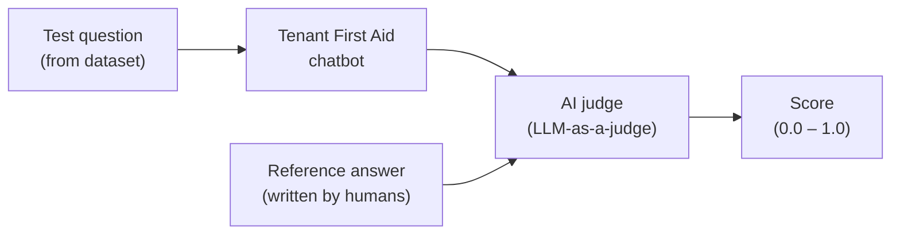
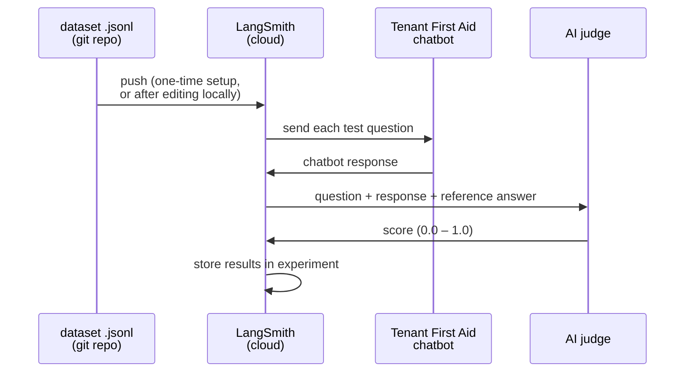
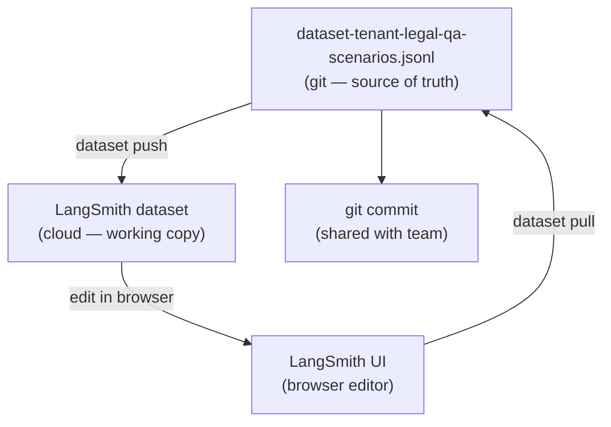
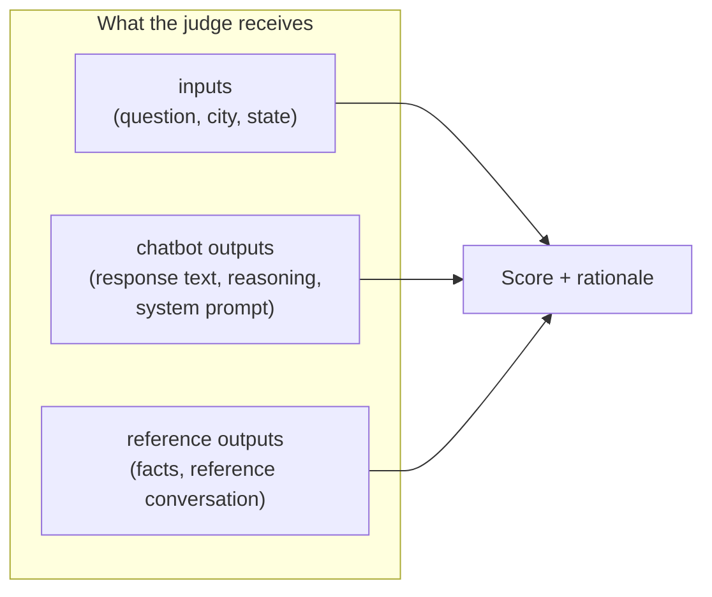
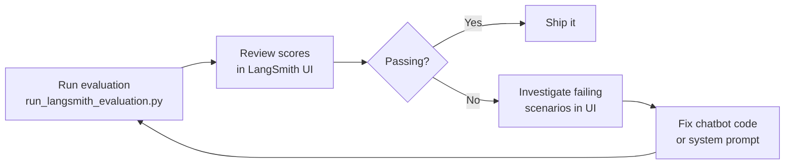
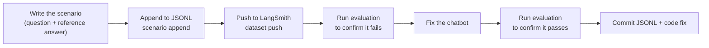
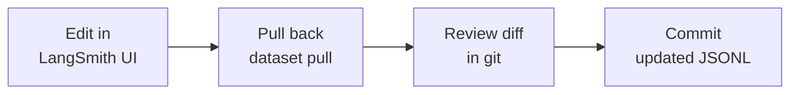

# Automated Evaluation with LangSmith

## What is this and why does it matter?

The chatbot gives legal information to tenants. Getting that information wrong — citing the wrong statute, misstating a deadline, using a dismissive tone — has real consequences for real people. We need a systematic way to check quality, not just hope spot-checks catch problems.

This system runs a suite of test questions through the chatbot automatically, then uses a second AI model ("LLM-as-a-judge") to score the responses against a known-good reference answer. The result is a pass/fail score for each question, surfaced in an online dashboard.

Think of it like a mock client. You hand the chatbot a question you already know the answer to, and measure whether it gets it right.



---

## The dataset — the source of truth

The file `evaluate/dataset-tenant-legal-qa-scenarios.jsonl` is the authoritative list of test scenarios. Every scenario contains:

- **The question** — exactly what a tenant might type
- **Context** — city and state, because tenant law varies by jurisdiction
- **Reference answer** — a human-verified model conversation showing what a correct, well-toned response looks like
- **Key facts** — the legal facts the response must get right

This file lives in the git repository so that all contributors share the same set of test cases. Changes to scenarios should be committed here, not left only in the cloud.

### What a scenario looks like

```
inputs:   { "query": "My landlord hasn't fixed my heat for two weeks — what can I do?",
            "city": null, "state": "OR" }

outputs:  { "facts":  ["Landlord has failed to repair heating for 14 days",
                       "ORS 90.365 allows rent reduction after 7 days notice"],
            "reference_conversation": [ {human turn}, {bot turn} ] }
```

---

## How data flows through the system

### Running an evaluation



1. The dataset is uploaded to LangSmith (only needed once, or after changes).
2. LangSmith feeds each test question to the chatbot, one at a time.
3. The chatbot responds just as it would for a real user.
4. LangSmith sends the question, the chatbot's response, and the reference answer to the AI judge.
5. The judge scores the response and LangSmith stores the results.
6. You review scores in the LangSmith dashboard.

### Editing scenarios and keeping the repo in sync

The LangSmith online editor is the most convenient way to refine a reference answer or reword a test question. But edits made in the browser don't automatically flow back into the git repository. The pull step closes that loop.



**The rule:** anything you change in the browser must be pulled back and committed. The JSONL file is what other contributors see.

---

## Setup

1. Sign up for a free account at https://smith.langchain.com/ (Personal workspace is sufficient).
2. Generate an API key from your account settings.
3. Add it to `backend/.env`:

```bash
LANGSMITH_API_KEY=your-api-key
```

---

## Dataset management

All dataset operations go through `evaluate/langsmith_dataset.py`. Commands below assume you are in the `backend/` directory.

### Initial push (first-time or after local edits)

```bash
uv run python evaluate/langsmith_dataset.py dataset push \
  evaluate/dataset-tenant-legal-qa-scenarios.jsonl \
  tenant-legal-qa-scenarios
```

Creates the dataset in LangSmith if it doesn't exist, then uploads all scenarios.

### Pull after editing in the browser

```bash
uv run python evaluate/langsmith_dataset.py dataset pull \
  tenant-legal-qa-scenarios \
  evaluate/dataset-tenant-legal-qa-scenarios.jsonl
```

Overwrites the local file with whatever is currently in LangSmith. Commit the result.

### Validate the local file

```bash
uv run python evaluate/langsmith_dataset.py dataset validate \
  evaluate/dataset-tenant-legal-qa-scenarios.jsonl
```

Checks every line against the schema before pushing, catching formatting mistakes early.

### Fine-grained scenario operations

```bash
# List all scenarios (shows scenario_id, tags, and the first 80 characters of the question)
uv run python evaluate/langsmith_dataset.py scenario list tenant-legal-qa-scenarios

# Append new scenarios from a JSONL file without touching existing ones
uv run python evaluate/langsmith_dataset.py scenario append \
  tenant-legal-qa-scenarios new-scenarios.jsonl

# Remove a scenario by its scenario_id
uv run python evaluate/langsmith_dataset.py scenario remove \
  tenant-legal-qa-scenarios 42
```

---

## Running evaluations

```bash
cd backend

# Run evaluation on the full dataset
uv run python evaluate/run_langsmith_evaluation.py

# Run with a custom experiment label (useful for comparing before/after a change)
uv run python evaluate/run_langsmith_evaluation.py \
  --dataset "tenant-legal-qa-scenarios" \
  --experiment "my-experiment" \
  --num-repetitions 1
```

Results appear in the LangSmith dashboard under your dataset's Experiments tab.

### CI/CD

PRs from forked repos don't have access to repository secrets (including `LANGSMITH_API_KEY`), so evaluations cannot run automatically in CI. Run evaluations locally before submitting a pull request for any change that might affect response quality.

---

## What the scores mean

Each scenario gets a score between 0.0 and 1.0 for each active evaluator. The overall pass rate is the average across all scenarios.

### Legal Correctness

Is the legal information accurate under Oregon tenant law?

| Score | Meaning |
|-------|---------|
| 1.0 | Legally accurate |
| 0.5 | Partially correct or missing important nuance |
| 0.0 | Legally wrong or misleading |

### Tone

Is the response appropriately professional, accessible, and empathetic?

| Score | Meaning |
|-------|---------|
| 1.0 | Gets the tone right |
| 0.5 | Too formal, too casual, or inconsistent |
| 0.0 | Dismissive, condescending, or inappropriate |

**Patterns that fail tone evaluation:**
- Opening with "As a legal expert..." (implies the chatbot is giving legal advice, which it isn't)
- Dense legal jargon without plain-language explanation
- Dismissive or condescending phrasing

### Under construction 🚧

These evaluators exist in the code but are disabled pending calibration: citation accuracy, citation format, completeness, tool usage, performance.

---

## How the judge sees each scenario

When the AI judge scores a response, it receives:



The judge compares what the chatbot actually said against what it should have said, given the same question and context.

---

## Viewing and comparing results

Open https://smith.langchain.com/ → your dataset → **Experiments** tab.

From there you can:
- See per-scenario scores and the judge's written rationale for each score
- Compare two experiments side-by-side to measure the impact of a code change
- Filter to failing scenarios to understand where the chatbot struggles

To compare two experiments from the command line:

```bash
uv run python evaluate/langsmith_dataset.py experiment compare \
  tfa-baseline tfa-my-experiment
```

---

## Typical workflows

### "I want to check quality before a release"



### "I found a chatbot mistake and want to add a test for it"



### "I want to improve a reference answer using the browser editor"



---

## Environment variables

```bash
# Required
GOOGLE_CLOUD_PROJECT=your-project
GOOGLE_CLOUD_LOCATION=us-central1
VERTEX_AI_DATASTORE=projects/.../datastores/...
LANGSMITH_API_KEY=your-api-key

# Optional
LANGSMITH_PROJECT=tenant-first-aid-dev  # LangSmith project name
LANGSMITH_TRACING=true
LANGCHAIN_TRACING_V2=true               # Enable detailed tracing
MODEL_NAME=gemini-2.5-pro               # Model to evaluate
SHOW_MODEL_THINKING=true                # Capture model reasoning in the evaluator run view
```

---

## Troubleshooting

### "Dataset not found"

The dataset hasn't been pushed yet. Run:
```bash
uv run python evaluate/langsmith_dataset.py dataset push \
  evaluate/dataset-tenant-legal-qa-scenarios.jsonl \
  tenant-legal-qa-scenarios
```

### Scores seem wrong or inconsistent

LLM-as-judge has its own biases and can be inconsistent on borderline cases. Review the judge's written rationale for specific failing scenarios in the LangSmith UI, then refine the evaluator prompts in `evaluate/langsmith_evaluators.py` if the scoring logic is the problem.

### Evaluation is too slow

Pass `--max-concurrency 3` (or higher) to run multiple scenarios in parallel, or temporarily reduce the dataset size in LangSmith to evaluate a representative subset.
