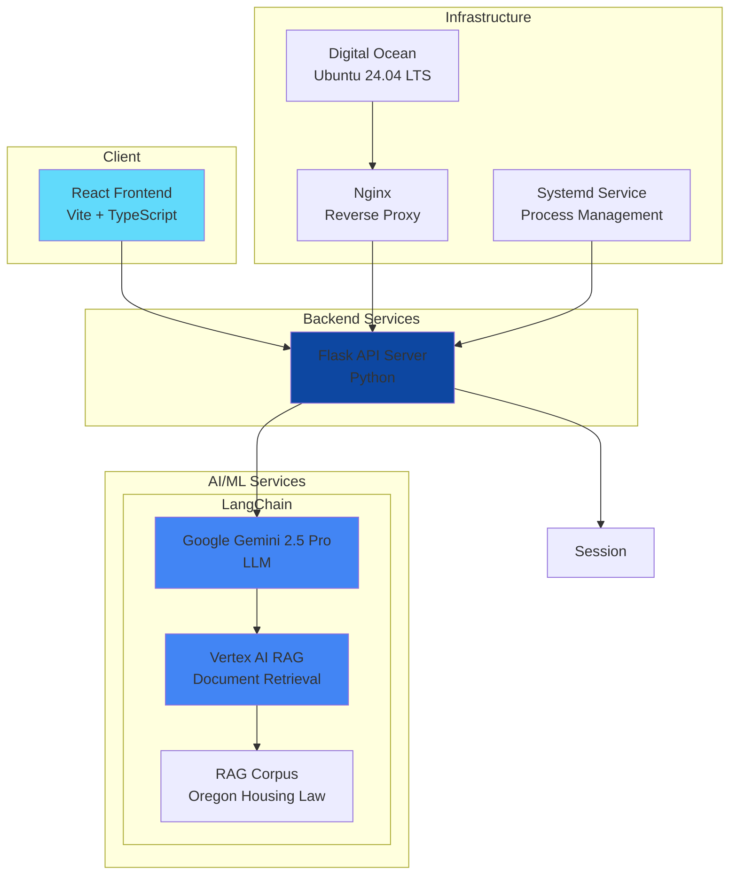

# System Overview

Tenant First Aid is a chatbot application that provides legal information related to housing and eviction in Oregon. The system uses a Retrieval-Augmented Generation (RAG) architecture to provide accurate, contextual responses based on Oregon housing law documents. The LangChain framework is used to abstract models and agents.

The application follows a modern web architecture with a Flask-based Python backend serving a React frontend, deployed on Digital Ocean infrastructure.

## Key components

- **Frontend**: React 19 + TypeScript + Vite + Tailwind CSS
- **Backend**: Flask API with LangChain agent orchestration
- **LLM**: Google Gemini 2.5 Pro via Vertex AI
- **Retrieval**: Vertex AI RAG with metadata filtering for jurisdiction-specific responses
- **Infrastructure**: Digital Ocean Droplet (Ubuntu 24.04) with Nginx reverse proxy

## Data flow

1. User asks a question in the React frontend
2. Question is sent to Flask API (`/api/query`)
3. Flask passes to LangChain agent
4. Agent decides to call RAG retrieval tool
5. Vertex AI RAG searches the document corpus with location context
6. Results are sent back to Gemini LLM
7. Gemini generates a response citing relevant statutes
8. Response streams back to frontend character-by-character
9. Frontend renders the response in real-time

---

**Next**: [Backend Overview](02-backend-overview.md)
