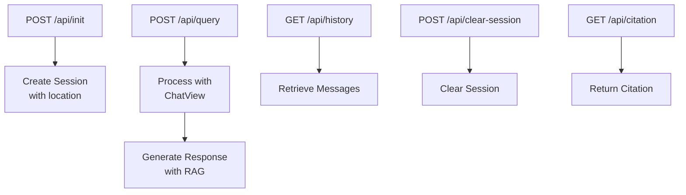

# Backend Overview

The backend is a Flask-based Python application that serves as the API layer for the chatbot. It handles user sessions and manages conversations. LangChain orchestrates interactions with Google's Gemini and Vertex AI services for RAG-based responses.

## Technology stack

**Core Technologies:**

- **Flask 3.1.1**: Web framework for API endpoints
- **Python 3.12+**: Application language
- **Gunicorn 23.0.0**: WSGI HTTP server for production
- **Vertex AI**: Google Cloud AI platform for LLM and RAG
- **Google Gemini 2.5 Pro**: Large language model
- **LangChain 1.1+**: Agent orchestration framework

## Directory structure

```
backend/
├── tenantfirstaid/                     # Main application package
│   ├── __init__.py
│   ├── app.py                          # Flask application setup and routing
│   ├── chat.py                         # Flask ChatView
│   ├── schema.py                       # Pydantic response chunk types
│   ├── constants.py                    # Consolidated environment variables
│   ├── location.py                     # City & State normalization
│   ├── graph.py                        # Shared LLM, tools, graph factory
│   ├── langchain_chat_manager.py       # Per-session agent wrapper
│   ├── langchain_tools.py              # RAG retriever and letter tools
│   ├── google_auth.py                  # GCP credential loading
│   ├── system_prompt.md                # System prompt (editable)
│   ├── letter_template.md              # Letter template (editable)
│   ├── feedback.py                     # Feedback and email integration
│   └── sections.json                   # Legal section mappings
├── evaluate/                           # LangSmith evaluation tooling
│   ├── __init__.py
│   ├── langsmith_dataset.py            # Dataset CLI
│   ├── langsmith_evaluators.py         # LLM-as-a-judge configuration
│   ├── run_langsmith_evaluation.py     # Evaluation runner
│   ├── langsmith_example_schema.json  # Validation schema
│   ├── dataset-tenant-legal-qa-examples.jsonl  # Test examples
│   ├── evaluators/                     # Scoring rubrics
│   └── EVALUATION.md                   # Evaluation docs
├── scripts/                            # Utility scripts
│   ├── simple_langchain_demo.py
│   ├── vertex_ai_list_datastores.py
│   ├── convert_csv_to_jsonl.py
│   ├── generate_types.py               # Type generation for frontend
│   ├── generate_conversation/
│   └── documents/                      # Source legal documents
├── tests/                              # Test suite
├── langgraph.json                      # LangGraph deployment manifest
├── pyproject.toml                      # Python dependencies
└── Makefile                            # Development commands
```

## API endpoints

The backend exposes the following REST API endpoints:

| Endpoint             | Method | Description                               |
|----------------------|--------|-------------------------------------------|
| `/api/init`          | POST   | Initialize new chat session with location |
| `/api/query`         | POST   | Send user message and get AI response     |
| `/api/history`       | GET    | Retrieve conversation history             |
| `/api/clear-session` | POST   | Clear current session                     |
| `/api/citation`      | GET    | Retrieve specific legal citation          |
| `/api/feedback`      | POST   | Send user feedback as PDF via email       |

**API Flow:**



## Configuration

All configuration goes through `tenantfirstaid/constants.py`, which reads from environment variables. Key variables include:

- `MODEL_NAME` — Gemini model identifier
- `GOOGLE_APPLICATION_CREDENTIALS` — GCP credentials (file path)
- `GOOGLE_CLOUD_PROJECT` — GCP project ID
- `GOOGLE_CLOUD_LOCATION` — Vertex AI region
- `VERTEX_AI_DATASTORE` — RAG corpus ID
- `SHOW_MODEL_THINKING` — Enable reasoning display (staging only)

See [Deployment: Secrets and configuration](../Deployment/06-secrets-configuration.md) for how these are managed in production.

---

**Next**: [RAG & Document Retrieval](03-backend-rag.md)
