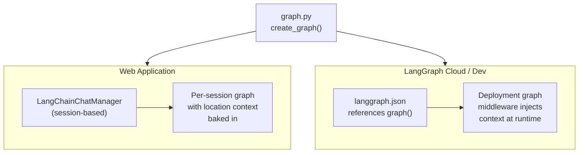
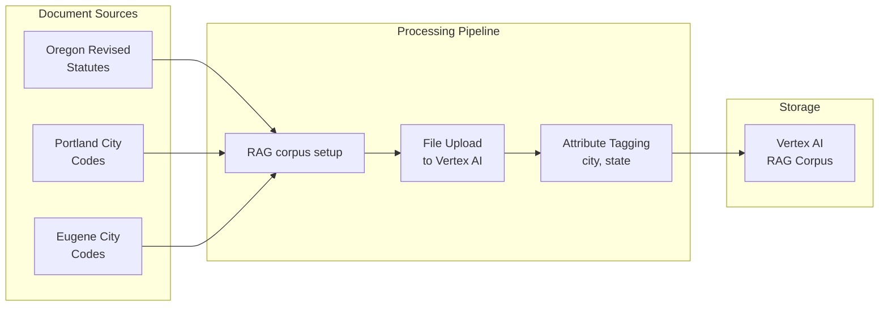
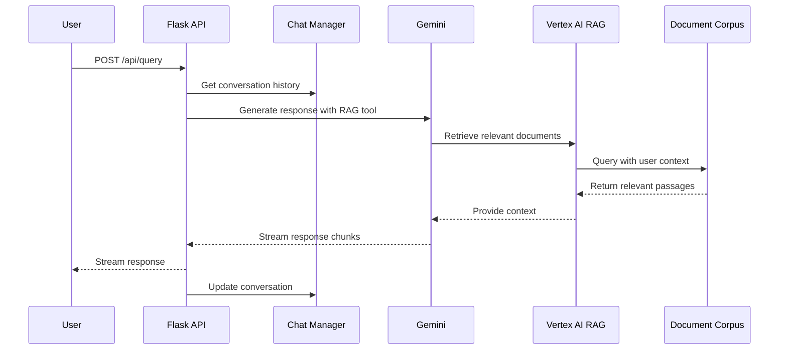

# RAG & Document Retrieval

The system uses **LangChain agents** with **Vertex AI RAG** tools for document retrieval. This combines LangChain's agent orchestration with Google's Vertex AI vector search capabilities and the Gemini language model.

## Architecture type

- **Framework**: LangChain 1.1+
- **LLM Integration**: ChatGoogleGenerativeAI (langchain-google-genai 4.0+)
- **Agent Pattern**: `create_agent()` with custom RAG tools
- **Retrieval Method**: Dense vector similarity search with metadata filtering (VertexAISearchRetriever)

## Agent tools

The agent has access to three tools:

1. **`retrieve_city_state_laws`** — Searches documents filtered by city (optional) and state
2. **`get_letter_template`** — Returns a pre-formatted letter template for the model to fill in
3. **`generate_letter`** — Emits the completed letter as a custom stream chunk for the frontend to render

The LLM decides how to call the tools based on the user's query and location context.

## Agent entry points

The agent graph is defined once in `graph.py` and consumed by two entry points:

**Web application path**: `LangChainChatManager` calls `create_graph()` with a per-session system prompt that includes the user's city/state. It handles streaming response chunks back to the Flask API.

**LangGraph dev / Cloud path**: `langgraph.json` points to the module-level `graph` instance in `graph.py`. This enables `langgraph dev` for local Studio testing and LangSmith Cloud deployment for browser-based evaluation. See [EVALUATION.md](../Evaluation/README.md) for details.

## Data ingestion pipeline

The RAG system processes legal documents to create a searchable knowledge base:

**Data Ingestion Process:**

1. **Document Collection**: Legal documents are stored as text files organized by jurisdiction:
   - State laws: `backend/scripts/documents/or/*.txt`
   - City codes: `backend/scripts/documents/or/portland/*.txt`, `backend/scripts/documents/or/eugene/*.txt`

2. **Vector Store Creation**: The corpus was set up via a one-time script that is no longer in the repository. Documents are processed by directory structure, tagged with city/state metadata, and uploaded to the Vertex AI RAG corpus with UTF-8 encoding.

3. **Metadata Attribution**: Documents are tagged with jurisdiction metadata to enable location-specific queries.

## Query pipeline

The query pipeline retrieves relevant legal information and generates responses:

**Query Process:**

1. **Context Preparation**: User query is combined with conversation history and location context
2. **RAG Retrieval**: Vertex AI RAG searches the document corpus for relevant legal passages
3. **Response Generation**: Gemini generates contextual responses using retrieved documents
4. **Streaming Response**: Response is streamed back to the client in real-time
5. **Session Update**: Conversation state is persisted for continuity

---

**Next**: [Streaming Response Implementation](04-backend-streaming.md)
