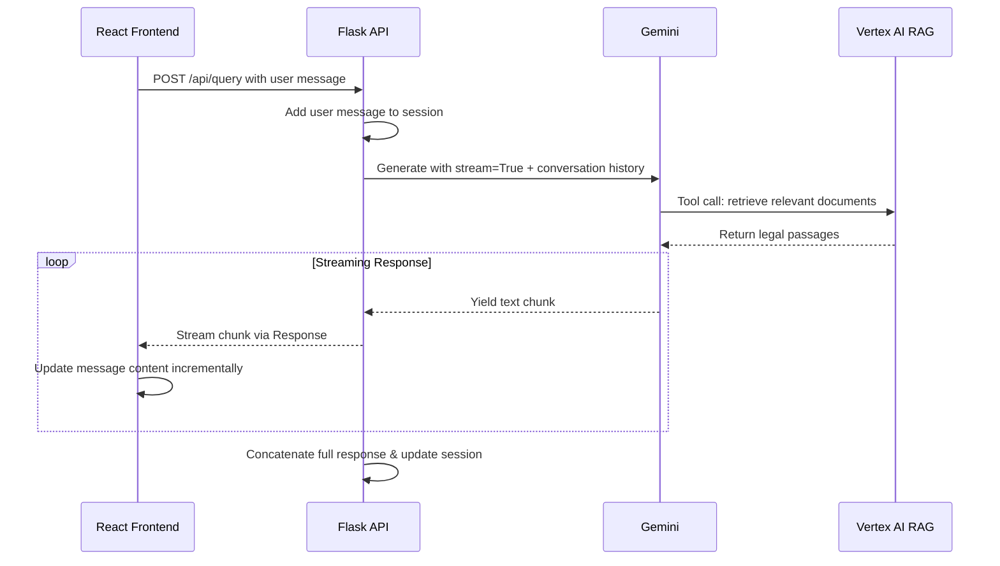

# Streaming Response Implementation

The application implements real-time response streaming to provide immediate feedback as the AI generates responses, creating a natural chat experience.

## Streaming architecture



## Frontend streaming implementation

**Stream Processing** (`streamHelper.ts`):

```typescript
async function streamText({
  addMessage,
  setMessages,
  housingLocation,
  setIsLoading,
}: StreamTextOptions): Promise<boolean | undefined> {
  const botMessageId = (Date.now() + 1).toString();

  setIsLoading?.(true);

  // Add empty bot message immediately so "Typing..." appears before the API responds.
  setMessages((prev) => [
    ...prev,
    new AIMessage({ content: "", id: botMessageId }),
  ]);

  try {
    const reader = await addMessage(housingLocation);
    if (!reader) {
      console.error("Stream reader is unavailable");
      const nullReaderError: UiMessage = {
        type: "ui",
        text: "Sorry, I encountered an error. Please try again.",
        id: botMessageId,
      };
      setMessages((prev) =>
        prev.map((msg) => (msg.id === botMessageId ? nullReaderError : msg)),
      );
      return;
    }

    const decoder = new TextDecoder();
    let buffer = "";
    let fullText = "";

    while (true) {
      const { done, value } = await reader.read();
      if (done) {
        // Flush any remaining content in the buffer.
        if (buffer.trim() !== "") processLines([buffer]);
        return true;
      }
      buffer += decoder.decode(value, { stream: true });
      const lines = buffer.split("\n");
      buffer = lines.pop() || "";
      processLines(lines);
    }
  } catch (error) {
    console.error("Error:", error);
    const errorMessage: UiMessage = {
      type: "ui",
      text: "Sorry, I encountered an error. Please try again.",
      id: botMessageId,
    };
    setMessages((prev) => [
      ...prev.filter((msg) => msg.id !== botMessageId),
      errorMessage,
    ]);
  } finally {
    setIsLoading?.(false);
  }
}
```

## Streaming features

- **Real-time Display**: Text appears character-by-character as generated
- **Fetch Streams API**: Uses native browser `ReadableStream` via `response.body.getReader()`
- **Error Handling**: Graceful fallback to error message if streaming fails
- **UI Responsiveness**: Loading states and disabled inputs during generation
- **Session Persistence**: Complete response saved to session storage after streaming
- **Custom Content Blocks**: Special response types (e.g., generated letters) are rendered separately

## Performance benefits

- **Reduced Perceived Latency**: Users see responses immediately as they're generated
- **Better UX**: Natural conversation flow without waiting for complete responses
- **Scalability**: Server can handle multiple concurrent streaming connections
- **Memory Efficiency**: Chunks are processed incrementally rather than buffering entire responses

---

**Next**: [Frontend Overview](05-frontend-overview.md)
