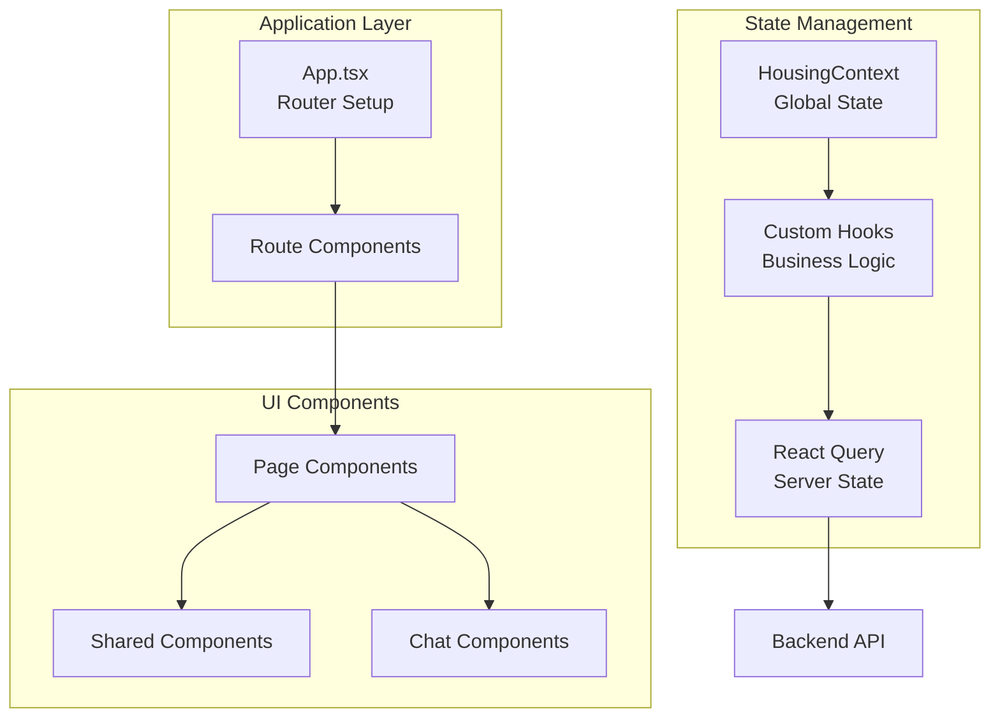

# Frontend Overview

The frontend is a modern React application built with TypeScript and Vite. It provides a clean, accessible chat interface for users to interact with the legal advice chatbot.

## Technology stack

**Core Technologies:**

- **React 19.0.0**: Component-based UI library
- **TypeScript 5.7.2**: Type-safe JavaScript
- **Vite 6.3.1**: Fast build tool and dev server
- **Tailwind CSS 4.1.6**: Utility-first CSS framework

**State Management:**

- **React Query (@tanstack/react-query)**: Server state management
- **React Router DOM**: Client-side routing
- **React Context**: Application-wide state

## Directory structure

```
frontend/
├── src/
│   ├── App.tsx                     # Main application component with routing
│   ├── Chat.tsx                    # Chat page component
│   ├── Letter.tsx                  # Letter page component
│   ├── About.tsx                   # About page
│   ├── Disclaimer.tsx              # Legal disclaimer
│   ├── PrivacyPolicy.tsx           # Privacy policy
│   ├── main.tsx                    # Application entry point
│   ├── style.css                   # Global styles
│   ├── contexts/
│   │   └── HousingContext.tsx      # Housing context for chat/letter
│   ├── hooks/
│   │   ├── useIsMobile.tsx         # Mobile state detection
│   │   ├── useMessages.tsx         # Message handling logic
│   │   ├── useHousingContext.tsx   # Housing context custom hook
│   │   └── useLetterContent.tsx    # Letter state management
│   ├── types/
│   │   └── models.ts                  # Auto-generated from backend (gitignored)
│   ├── layouts/
│   │   └── PageLayout.tsx          # Page layout wrapper
│   ├── pages/
│   │   ├── Chat/
│   │   │   ├── components/
│   │   │   │   ├── ChatDisclaimer.tsx
│   │   │   │   ├── InitializationForm.tsx
│   │   │   │   ├── AutoExpandText.tsx
│   │   │   │   ├── ExportMessagesButton.tsx
│   │   │   │   ├── InputField.tsx
│   │   │   │   ├── FeedbackModal.tsx
│   │   │   │   ├── MessageContent.tsx
│   │   │   │   ├── MessageWindow.tsx
│   │   │   │   └── SelectField.tsx
│   │   │   └── utils/
│   │   │       ├── exportHelper.ts
│   │   │       ├── feedbackHelper.ts
│   │   │       ├── formHelper.ts
│   │   │       └── streamHelper.ts
│   │   ├── Letter/
│   │   │   ├── components/
│   │   │   │   ├── LetterDisclaimer.tsx
│   │   │   │   └── LetterGenerationDialog.tsx
│   │   │   └── utils/
│   │   │       └── letterHelper.ts
│   │   └── LoadingPage.tsx
│   ├── shared/
│   │   ├── types/
│   │   │   └── messages.ts         # Frontend message type definitions
│   │   ├── components/
│   │   │   ├── Navbar/
│   │   │   │   ├── Sidebar.tsx
│   │   │   │   ├── Navbar.tsx
│   │   │   │   └── NavbarMenuButton.tsx
│   │   │   ├── BackLink.tsx
│   │   │   ├── BeaverIcon.tsx      # Oregon-themed icon
│   │   │   ├── DisclaimerLayout.tsx
│   │   │   ├── FeatureSnippet.tsx
│   │   │   ├── MessageContainer.tsx
│   │   │   ├── PageSection.tsx
│   │   │   ├── SafeMarkdown.tsx    # Markdown with sanitization
│   │   │   └── TenantFirstAidLogo.tsx
│   │   ├── constants/
│   │   │   └── constants.ts
│   │   └── utils/
│   │       ├── scrolling.ts
│   │       ├── dompurify.ts        # HTML sanitization
│   │       └── formatLocation.ts   # Location formatting
│   └── tests/
│       ├── components/
│       ├── hooks/
│       └── utils/
├── public/
│   └── favicon.svg
├── package.json
├── vite.config.ts
├── vitest.config.ts
├── tsconfig.json
└── eslint.config.js
```

## Frontend architecture



## Message types

The frontend uses LangChain's `HumanMessage` and `AIMessage` classes directly to keep message types consistent with the backend:

```typescript
import type { AIMessage, HumanMessage } from "@langchain/core/messages";

type UiMessage = { type: "ui"; text: string; id: string };
type ChatMessage = HumanMessage | AIMessage | UiMessage;
```

LangChain's `BaseMessage` exposes several accessors for message data:
- `.content` — the raw message content (`string | Array<ContentBlock>`)
- `.text` — a getter that returns `.content` as a `string` (handles content block arrays)
- `.type` — the message role (`"human"` or `"ai"`)
- `.id` — unique message identifier

When serializing messages for the backend API, the hook maps these to the format the backend expects:

```typescript
const serializedMsg = messages.map((msg) => ({
  role: msg.type,
  content: msg.type === "ai" ? deserializeAiMessage(msg.text) : msg.text,
  id: msg.id,
}));
```

## Type generation

Frontend TypeScript types are auto-generated from backend Pydantic models via the `generate-types` script:

```bash
npm run generate-types
```

This runs `backend/scripts/generate_types.py` which emits a JSON Schema, piped through `json-schema-to-typescript` to produce `frontend/src/types/models.ts` (gitignored). 

**Important**: You must run this before building or type-checking after any backend schema changes.

---

**Next**: [Conversation Management](06-conversation-management.md)
