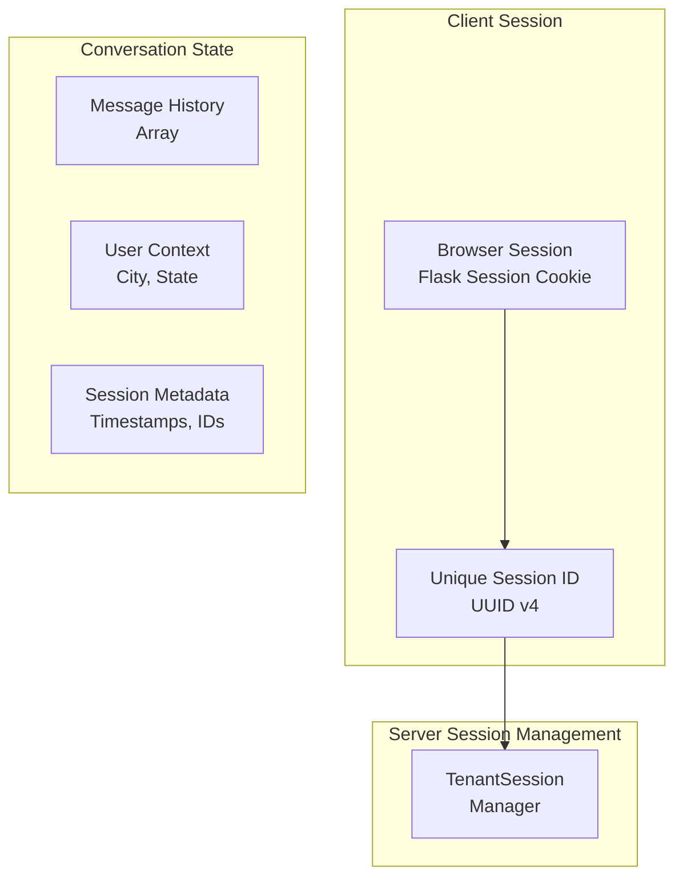

# Conversation Management

The system maintains conversational context across multiple interactions by appending human and AI messages (including reasoning) to follow-up queries.

## Session architecture

:construction: TODO: update this section



## Session data structure

```typescript
interface TenantSessionData {
  city: string; // User's city (e.g., "portland", "eugene", "null")
  state: string; // User's state (default: "or")
  messages: Array<{
    // Complete conversation history
    role: "human" | "ai";
    content: string;
  }>;
}
```

## Multi-turn implementation

**Session Initialization** (`/api/init`):
- Creates UUID v4 session identifier :construction:
- Initializes empty message array
- Stores user location context (city/state)
- Uses Flask secure session cookies :construction:

**Conversation Flow**:
- Each message exchange appends to `messages` array
- Complete conversation history sent to Gemini for context
- Location metadata enables jurisdiction-specific legal advice

**Context Preservation**:
- Full message history passed to Gemini API on each request
  - Preserving Reasoning and Thought Signatures
- System instructions include location-specific context
- Previous legal advice references maintained across turns
- Citation links and legal precedents remain accessible

**Session Management**:
- **Persistence**: Sessions survive server restarts
- **Security**: HttpOnly, SameSite cookies with secure flag in production
- **Cleanup**: Sessions can be cleared via `/api/clear-session`

---

**Related documentation**:
- [Deployment](../Deployment/README.md) — how sessions are deployed and managed
- [EVALUATION](../Evaluation/README.md) — testing multi-turn conversations
