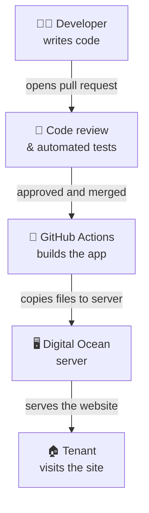

# Overview for Stakeholders

Tenant First Aid runs as a public website at [tenantfirstaid.com](https://tenantfirstaid.com). "Deployment" is the process of taking code changes written by volunteers and making them live for users.

## Key points

- **Who manages deployments?** Project admins at [Code for PDX](https://codeforpdx.org/) control the server and deployment pipeline. See [Permissions](09-permissions.md) to request access.
- **Where does it run?** A single server ("droplet") hosted on [Digital Ocean](https://www.digitalocean.com/), a cloud provider. It serves both the website UI and the AI-powered backend.
- **How often does it deploy?** Every time a change is merged into the `main` branch, the site updates automatically within a few minutes.
- **Is there a staging environment?** Yes — a separate server mirrors production and is used for testing changes before they reach users. It is triggered manually by a maintainer.
- **What AI service powers the chatbot?** Google's Gemini 2.5 Pro model via Google Cloud (Vertex AI), not the server itself.

---

**Next**: [Environments](02-environments.md)
