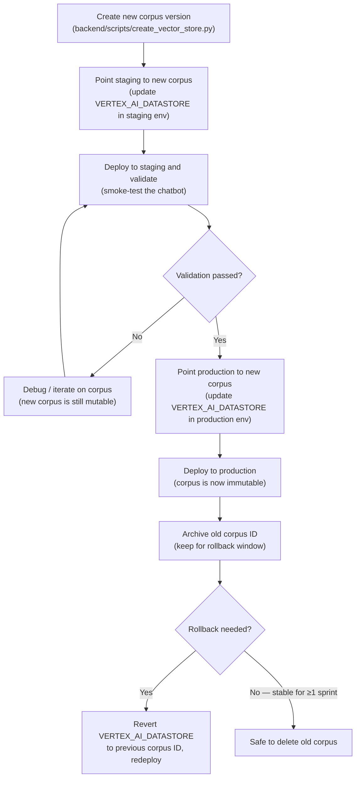

# Deployment Principles

- **Reproducibility**: Python dependencies are pinned in `backend/uv.lock`; Node dependencies are pinned in `frontend/package-lock.json`. The same commit always produces the same build.
- **No secrets in code**: secrets are never committed to the repository. They are stored encrypted in GitHub Actions environments and written to the server at deploy time (see [Secrets and configuration](06-secrets-configuration.md)).
- **Continuous delivery**: every merge to `main` automatically triggers a production deploy via GitHub Actions with no manual steps.
- **Single concurrency**: the `deploy-to-droplet` concurrency group ensures only one deploy runs at a time; a newer push cancels an in-progress deploy.
- **Supply-chain security**: all third-party GitHub Actions are pinned to commit SHAs rather than floating version tags. See [CLAUDE.md](../../.claude/CLAUDE.md) for the pinning policy.
- **Configuration as code**: server configuration files (Nginx, systemd) are version-controlled in `config/`. See [Server configuration](07-server-configuration.md) for the caveat on syncing them.
- **External artifact immutability**: production external artifacts must not be modified in-place while in use. Follow a copy → modify → update-deployment pattern: create a new artifact version, validate it in staging, then update the relevant environment variable and redeploy.

## External artifact lifecycle

"External artifacts" are resources that live outside the application code and are referenced by environment variable at runtime — most importantly the Vertex AI RAG corpus, but also cloud storage objects and any future database.

### Artifact types and immutability trigger

| Artifact type | Current example | Becomes immutable when… |
|---------------|-----------------|-------------------------|
| **Vertex AI RAG corpus** (data store) | `VERTEX_AI_DATASTORE` | Deployed to any live environment (staging or production) |
| **Cloud storage objects** (GCS files, etc.) | — (not currently used) | Deployed and referenced by a running service |
| **Database** (relational / document) | — (not currently used) | Tables / collections referenced by a live deployment |

Once immutable, an artifact **must never be mutated in-place**. The risk is that an in-flight request, a rollback, or a concurrent staging run would then see an inconsistent or corrupted view of the data.

### Lifecycle for the Vertex AI RAG corpus

**Rules:**
- A corpus is **mutable** until it is first deployed to any live environment.
- Once deployed, it is **immutable** — never add, remove, or reindex documents in that corpus.
- To update the knowledge base, always create a **new corpus** via `create_vector_store.py`.
- The old corpus must be **retained** for at least one sprint (or until the next successful deployment) to support rollback and bug reproduction.
- A corpus may be **deleted** only after: (1) it is no longer referenced by any environment, and (2) no open bugs require reproducing behavior against it.

### Rollbacks

To roll back to a previous corpus:
1. In GitHub [environment settings](https://github.com/codeforpdx/tenantfirstaid/settings/environments), revert `VERTEX_AI_DATASTORE` to the previous corpus ID.
2. Trigger a production deploy (push a revert commit or use `workflow_dispatch`).
3. Verify the site is serving correct answers.
4. Post a note in `#tenantfirstaid-general` on Discord describing the rollback and the reason.

Code rollbacks (reverting a bad commit) follow the same deploy-on-merge pattern; no special steps are needed beyond creating and merging a revert PR.

### Bug reproduction

When reproducing a production bug:
1. Use the staging environment, pointed at the same corpus ID that was active in production at the time of the bug.
2. Never delete a corpus while a bug referencing it is still open.
3. If the bug is in the LLM's behavior (not the corpus), use LangSmith traces from the time of the incident.

### Future artifact types (database, cloud storage)

No database or persistent cloud storage is currently used in production. When introduced, apply the same principle: create a versioned snapshot or migration, validate in staging, promote to production, retain the previous state through the rollback window.

---

**Next**: [Infrastructure](04-infrastructure.md)
