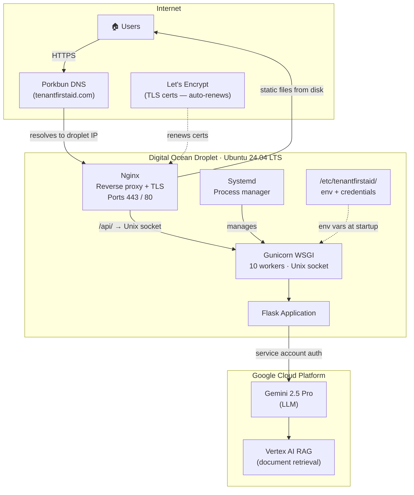

# Infrastructure

The application runs on a single Digital Ocean Droplet:

| Property | Value |
|----------|-------|
| Provider | [Digital Ocean](https://www.digitalocean.com/) |
| OS | Ubuntu LTS 24.04 |
| CPUs | 2 |
| RAM | 2 GB |
| Domain registrar / DNS | [Porkbun](https://porkbun.com/) — `tenantfirstaid.com` |
| TLS certificates | [Let's Encrypt](https://letsencrypt.org/) via Certbot (auto-renewing) |

## Infrastructure diagram

## Nginx

Nginx (config: [`config/tenantfirstaid.conf`](../../config/tenantfirstaid.conf)) does two things:

1. **Serves static files**: the built React frontend (`frontend/dist/`) is served directly from disk, with a fallback to `index.html` for client-side routing.
2. **Proxies API requests**: requests to `/api/` are forwarded to Gunicorn via a Unix domain socket (no TCP overhead).

All HTTP traffic is redirected to HTTPS. TLS is managed by Certbot.

## Gunicorn + systemd

The Flask backend runs under Gunicorn with 10 worker processes and a 300-second timeout (config: [`config/tenantfirstaid-backend.service`](../../config/tenantfirstaid-backend.service)). Systemd restarts the process on failure and ensures it starts on server reboot.

---

**Next**: [CI/CD Pipeline](05-cicd-pipeline.md)
