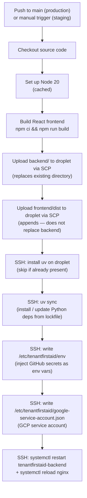

# CI/CD Pipeline

## Workflow files

- **Production**: [`.github/workflows/deploy.production.yml`](../../.github/workflows/deploy.production.yml) — triggers on every push to `main`.
- **Staging**: [`.github/workflows/deploy.staging.yml`](../../.github/workflows/deploy.staging.yml) — triggered manually via `workflow_dispatch` in the GitHub Actions UI.

The two workflows are structurally identical; the only difference is which GitHub Actions environment (`production` vs `staging`) they read credentials from.

> **Nginx config and systemd service are not auto-deployed.** The files in `config/` are version-controlled here for reference, but the CI pipeline does not copy them to the server. Changes to Nginx or systemd configuration require a manual step by a server admin (see [Manual server configuration changes](07-server-configuration.md#manual-server-configuration-changes)).

---

**Next**: [Secrets & Configuration](06-secrets-configuration.md)
