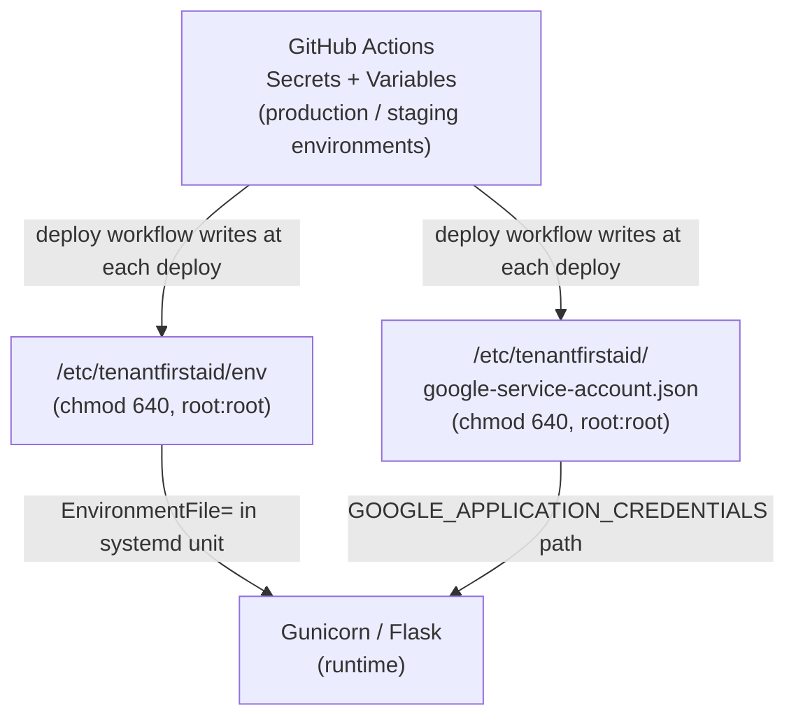

# Secrets & Configuration

## Where secrets live

Secrets exist in two places:

1. **GitHub Actions environments** — managed in [repository settings → Environments](https://github.com/codeforpdx/tenantfirstaid/settings/environments). Requires maintainer access to view or edit. Each deploy rewrites the on-server files from these values.
2. **On the server** — `/etc/tenantfirstaid/` holds the env file and GCP credentials JSON. The directory is restricted to root (750). The files within are readable by root and the group (640). Between deploys these files persist on disk; a new deploy always overwrites them.

## GitHub Actions secrets (sensitive)

> **⚠️ Potentially obsolete** items are flagged — they appear in the deploy workflow env file but have no corresponding `os.getenv()` call in the application source. They may be vestigial from a previous design; a maintainer should confirm before removing.

| Secret | Purpose | Referenced in |
|--------|---------|---------------|
| `SSH_KEY` | Private key for SSH / SCP access to the droplet | [deploy.production.yml](../../.github/workflows/deploy.production.yml), [deploy.staging.yml](../../.github/workflows/deploy.staging.yml) |
| `FLASK_SECRET_KEY` | ⚠️ Intended to sign Flask session cookies — **not read by any current application code**; Flask does not automatically pick this up from the environment | [deploy.production.yml](../../.github/workflows/deploy.production.yml) (env file only) |
| `GOOGLE_SERVICE_ACCOUNT_CREDENTIALS` | GCP service account JSON; grants access to Vertex AI (Gemini + RAG). Also used in PR checks for non-fork PRs | [deploy.production.yml](../../.github/workflows/deploy.production.yml), [deploy.staging.yml](../../.github/workflows/deploy.staging.yml), [pr-check.yml](../../.github/workflows/pr-check.yml) |
| `DB_HOST` | ⚠️ Database host address — **not read by any current application code**; no database layer exists in the backend | [deploy.production.yml](../../.github/workflows/deploy.production.yml) (env file only) |
| `DB_PASSWORD` | ⚠️ Database password — **not read by any current application code** | [deploy.production.yml](../../.github/workflows/deploy.production.yml) (env file only) |
| `APP_PASSWORD` | SMTP app-specific password for sending feedback emails | [deploy.production.yml](../../.github/workflows/deploy.production.yml), [backend/tenantfirstaid/app.py](../../backend/tenantfirstaid/app.py) |
| `SSH_USER` | SSH username on the droplet (staging environment only — stored as a secret there) | [deploy.staging.yml](../../.github/workflows/deploy.staging.yml) |

## GitHub Actions variables (non-sensitive)

| Variable | Purpose | Referenced in |
|----------|---------|---------------|
| `URL` | Droplet hostname or IP address | [deploy.production.yml](../../.github/workflows/deploy.production.yml), [deploy.staging.yml](../../.github/workflows/deploy.staging.yml) |
| `SSH_USER` | SSH username on the droplet (production — stored as a plain variable) | [deploy.production.yml](../../.github/workflows/deploy.production.yml) |
| `FRONTEND_DIR` | Path to `frontend/` within the repository | [deploy.production.yml](../../.github/workflows/deploy.production.yml), [deploy.staging.yml](../../.github/workflows/deploy.staging.yml) |
| `BACKEND_DIR` | Path to `backend/` within the repository | [deploy.production.yml](../../.github/workflows/deploy.production.yml), [deploy.staging.yml](../../.github/workflows/deploy.staging.yml) |
| `REMOTE_APP_DIR` | Deployment root on the server (e.g. `/var/www/tenantfirstaid`) | [deploy.production.yml](../../.github/workflows/deploy.production.yml), [deploy.staging.yml](../../.github/workflows/deploy.staging.yml) |
| `SERVICE_NAME` | Systemd service name (e.g. `tenantfirstaid-backend`) | [deploy.production.yml](../../.github/workflows/deploy.production.yml), [deploy.staging.yml](../../.github/workflows/deploy.staging.yml) |
| `ENV` | Runtime environment label (`prod` / `staging`) | [deploy.production.yml](../../.github/workflows/deploy.production.yml), [backend/tenantfirstaid/app.py](../../backend/tenantfirstaid/app.py) |
| `DB_PORT` | ⚠️ Database port — **not read by any current application code** | [deploy.production.yml](../../.github/workflows/deploy.production.yml) (env file only) |
| `MAIL_PORT` | SMTP port | [deploy.production.yml](../../.github/workflows/deploy.production.yml), [backend/tenantfirstaid/app.py](../../backend/tenantfirstaid/app.py) |
| `MAIL_SERVER` | SMTP server hostname | [deploy.production.yml](../../.github/workflows/deploy.production.yml), [backend/tenantfirstaid/app.py](../../backend/tenantfirstaid/app.py) |
| `SENDER_EMAIL` | Sender address for feedback emails | [deploy.production.yml](../../.github/workflows/deploy.production.yml), [backend/tenantfirstaid/app.py](../../backend/tenantfirstaid/app.py), [backend/tenantfirstaid/feedback.py](../../backend/tenantfirstaid/feedback.py) |
| `RECIPIENT_EMAIL` | Recipient address for feedback emails | [deploy.production.yml](../../.github/workflows/deploy.production.yml), [backend/tenantfirstaid/feedback.py](../../backend/tenantfirstaid/feedback.py) |
| `MODEL_NAME` | Gemini model identifier (e.g. `gemini-2.5-pro`) | [deploy.production.yml](../../.github/workflows/deploy.production.yml), [backend/tenantfirstaid/constants.py](../../backend/tenantfirstaid/constants.py) |
| `GOOGLE_CLOUD_PROJECT` | GCP project ID | [deploy.production.yml](../../.github/workflows/deploy.production.yml), [backend/tenantfirstaid/constants.py](../../backend/tenantfirstaid/constants.py), [pr-check.yml](../../.github/workflows/pr-check.yml) |
| `GOOGLE_CLOUD_LOCATION` | GCP region (e.g. `global`) | [deploy.production.yml](../../.github/workflows/deploy.production.yml), [backend/tenantfirstaid/constants.py](../../backend/tenantfirstaid/constants.py) |
| `VERTEX_AI_DATASTORE` | Vertex AI RAG corpus identifier | [deploy.production.yml](../../.github/workflows/deploy.production.yml), [backend/tenantfirstaid/constants.py](../../backend/tenantfirstaid/constants.py) |
| `SHOW_MODEL_THINKING` | Toggle Gemini reasoning display (staging only; hardcoded `false` in production) | [deploy.staging.yml](../../.github/workflows/deploy.staging.yml), [backend/tenantfirstaid/constants.py](../../backend/tenantfirstaid/constants.py) |

## Local development

Copy `backend/.env.example` to `backend/.env` and fill in the required values. See [README.md](../../README.md#prerequisites) for step-by-step instructions. The `.env` file is git-ignored and never committed. The variables in `.env.example` mirror the production configuration but use developer-specific credentials.

---

**Next**: [Server Configuration](07-server-configuration.md)
