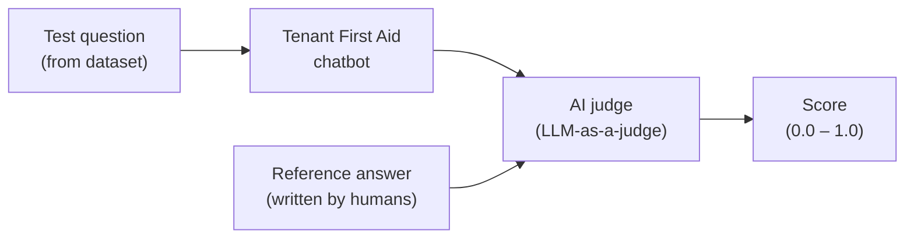

# Overview

## What is this and why does it matter?

The chatbot gives legal information to tenants. Getting that information wrong — citing the wrong statute, misstating a deadline, using a dismissive tone — has real consequences for real people. We need a systematic way to check quality, not just hope spot-checks catch problems.

This system runs a suite of test questions through the chatbot automatically, then uses a second AI model ("LLM-as-a-judge") to score the responses against a known-good reference answer. The result is a pass/fail score for each question, surfaced in an online dashboard.

Think of it like a mock client. You hand the chatbot a question you already know the answer to, and measure whether it gets it right.

---

**Next**: [Definitions](02-definitions.md)
