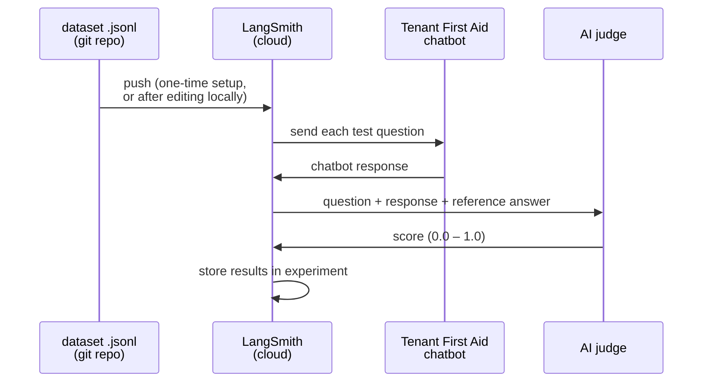
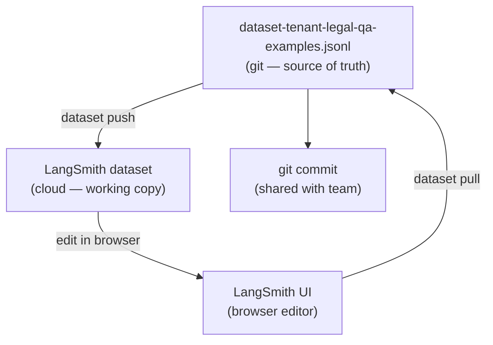

# Data Flow

## The dataset — the source of truth

The file `dataset-tenant-legal-qa-examples.jsonl` is the authoritative list of test examples. Every example contains:

- **The question** — exactly what a tenant might type
- **Context** — city and state, because tenant law varies by jurisdiction
- **Reference answer** — a human-verified model conversation showing what a correct, well-toned response looks like
- **Key facts** — the legal facts the response must get right

This file lives in the git repository so that all contributors share the same set of test cases. Changes to examples should be committed here, not left only in the cloud.

### What an example looks like

```
inputs:   { "query": "My landlord hasn't fixed my heat for two weeks — what can I do?",
            "city": null, "state": "OR" }

outputs:  { "facts":  ["Landlord has failed to repair heating for 14 days",
                       "ORS 90.365 allows rent reduction after 7 days notice"],
            "reference_conversation": [ {human turn}, {bot turn} ] }
```

## Running an evaluation



1. The dataset is uploaded to LangSmith (only needed once, or after changes).
2. LangSmith feeds each test question to the chatbot, one at a time.
3. The chatbot responds just as it would for a real user.
4. LangSmith sends the question, the chatbot's response, and the reference answer to the AI judge.
5. The judge scores the response and LangSmith stores the results.
6. You review scores in the LangSmith dashboard.

## Editing examples and keeping the repo in sync

The LangSmith online editor is the most convenient way to refine a reference answer or reword a test question. But edits made in the browser don't automatically flow back into the git repository. The pull step closes that loop.



**The rule:** anything you change in the browser must be pulled back and committed. The JSONL file is what other contributors see. Run `dataset diff` first to see what changed before overwriting either side.

---

**Next**: [Cloud Studio](04-cloud-studio.md)
