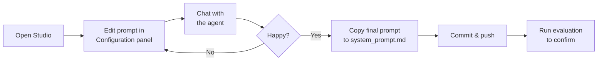

# Testing with Cloud Studio

> **Audience**: legal contributors with a LangSmith Plus-tier seat. No terminal required.
>
> If you're a frontend or content contributor running the agent locally, see [Local Studio](07-local-studio.md) instead.

Cloud Studio lets you chat with the full agent — tools, RAG retrieval, and all — directly in your browser. No installation required.

## Prerequisites

- A LangSmith **Plus-tier** seat
- Access to the project's Cloud deployment (ask a backend contributor to add you to the LangSmith workspace)

## Opening Studio

Go to **LangSmith → Deployments → your deployment → Studio**.

The agent is deployed from the `langgraph.json` manifest in `backend/`. Environment variables are managed in the deployment settings — you don't need to touch any of this.

## What you can do in Studio

- **Chat with the agent** — send questions a tenant might ask and see how it responds
- **Iterate on the system prompt** — edit the chatbot's instructions in the Configuration panel and re-test immediately, without redeploying (see [Editing the System Prompt](09-system-prompt.md))
- **Inspect tool calls** — see when the agent searched for laws, what it retrieved, and how it used the results
- **Step through graph execution** — see each node in the agent graph as it runs

## Iterating on the system prompt

The Configuration panel is the main reason lawyers use Studio. It lets you test prompt changes without involving a developer or waiting for a deployment.

See [Editing the System Prompt](09-system-prompt.md) for the full step-by-step.

## Running experiments

After refining the system prompt in Studio, the next step is to measure whether your changes improved scores across the full test suite. See [Running Experiments from the UI](06-bound-evaluators.md).

---

**Paths from here:**
- Edit the chatbot's instructions → [Editing the System Prompt](09-system-prompt.md)
- Edit what counts as a good answer → [Editing Evaluator Rubrics](10-evaluator-rubrics.md)
- Add or improve a test question → [Adding Examples in the Browser](05-examples-in-browser.md)
- Run a scored experiment → [Bound Evaluators](06-bound-evaluators.md)
