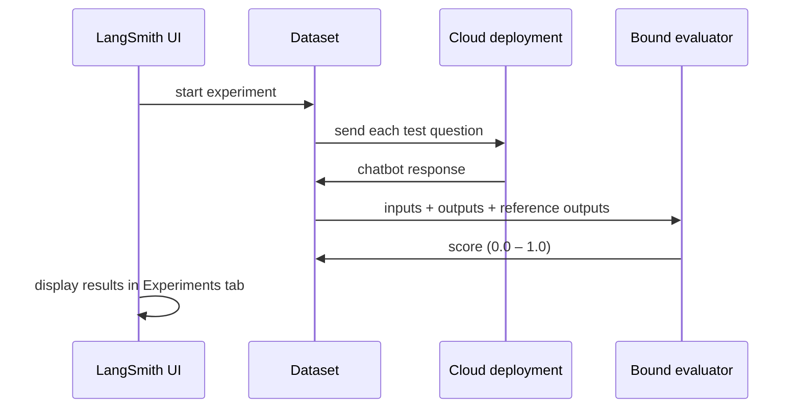

# Running Experiments from the UI

> **Audience**: legal contributors with a LangSmith Plus-tier seat. No terminal required.
>
> If you prefer the CLI, see [Running Evaluations (CLI)](14-running-evaluations.md).

A *bound evaluator* is an LLM-as-judge scoring rubric attached directly to the dataset in LangSmith. Once set up, you can start a scored experiment from the browser — LangSmith sends each test question to the deployed agent, collects responses, and scores them automatically.

## Prerequisites

- LangSmith **Plus-tier** seat
- Dataset `tenant-legal-qa-scenarios` already in LangSmith (a backend contributor handles this)
- A working [Cloud deployment](04-cloud-studio.md) of the agent

## How it works



## Running an experiment

1. Go to **LangSmith → Datasets → `tenant-legal-qa-scenarios` → Experiments tab**.
2. Click **+ New Experiment**.
3. Select the **Cloud deployment** as the target.
4. Click **Run**.

LangSmith sends each dataset example to the deployment, collects responses, and scores them with the bound evaluators automatically. Results appear in the Experiments tab alongside any previous runs.

> **Limitation**: the UI runs each example exactly once. Repeating a run multiple times to measure scoring variance requires the CLI (`--num-repetitions`). Ask a backend contributor if you need this.

## Setting up a bound evaluator (one-time, admin task)

If the bound evaluators haven't been set up yet, a backend contributor or admin can configure them. The steps below are for reference.

### Legal Correctness evaluator

1. Go to **LangSmith → Datasets → `tenant-legal-qa-scenarios` → Evaluators tab**.
2. Click **+ Add Evaluator → LLM-as-Judge**.
3. **Prompt**: paste the contents of `evaluators/legal_correctness.md` from the repo, wrapped in the boilerplate from `langsmith_evaluators.py:load_rubric`. Three placeholders (`{inputs}`, `{outputs}`, `{reference_outputs}`) are populated automatically by LangSmith.
4. **Model settings**:

   | Setting | Value |
   |---------|-------|
   | Provider | `Cloud providers: Google Vertex AI` |
   | API Key Name | `GOOGLE_VERTEX_AI_WEB_CREDENTIALS` |
   | Model | `gemini-2.5-flash` |
   | Temperature | `0.0` |

5. **Feedback configuration**:

   | Setting | Value |
   |---------|-------|
   | Feedback key | `legal correctness` |
   | Feedback type | Continuous |
   | Range | `0.0` – `1.0` |

6. Click **Save**.

Repeat with `evaluators/tone.md` and feedback key `appropriate tone` for the tone evaluator.

### Keeping rubrics in sync

There is no API to update a bound evaluator prompt programmatically. When a rubric file in `evaluators/` changes, update the bound evaluator prompt manually in the LangSmith UI.

To pull rubric changes from LangSmith back to the repo (if a lawyer edited the wording in the Playground):

```bash
# Find the prompt name.
uv run langsmith_dataset.py prompt list

# Dry-run to preview what changed.
uv run langsmith_dataset.py prompt pull tfa-legal-correctness evaluators/legal_correctness.md --dry-run

# Pull and commit.
uv run langsmith_dataset.py prompt pull tfa-legal-correctness evaluators/legal_correctness.md
git add evaluate/evaluators/legal_correctness.md
git commit -m "update legal correctness rubric from Prompt Hub"
```

This only works if the prompt uses `<Rubric>…</Rubric>` tags around the rubric text.

### Cost

Bound evaluators call the judge model on Vertex AI using your GCP service account (`GOOGLE_VERTEX_AI_WEB_CREDENTIALS`). Judge calls are billed to the Google Cloud account, not your LangSmith plan.

---

**Next**: [Viewing & Comparing Results](11-viewing-results.md)
