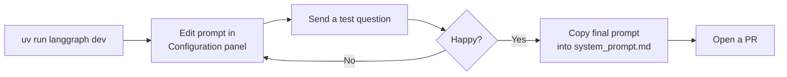

# Local Studio with `langgraph dev`

> **Audience**: frontend and content contributors comfortable with a terminal. No LangSmith account or Python knowledge required.
>
> If you have a LangSmith Plus-tier seat and prefer not to run anything locally, see [Cloud Studio](04-cloud-studio.md) instead.

`langgraph dev` runs the full agent — tools, RAG retrieval, and all — on your machine and opens the same Studio UI you'd get in LangSmith Cloud. It's the fastest way to test a prompt change or try a tricky question without waiting for a cloud deployment.

## Prerequisites

- GCP credentials in `backend/.env` (ask a backend contributor to set this up if you haven't already — it's the same `.env` used for local frontend development)
- `uv` installed (comes with the backend dev setup)

## Starting the local server

```bash
cd backend
uv run langgraph dev
```

This starts a local server on `http://localhost:2024` and opens Studio in your browser automatically.

> **Safari note**: Safari blocks the `http://` redirect. Use Chrome or Firefox instead, or pass `--no-browser` and navigate to the URL manually.

## What you can do in local Studio

Everything available in Cloud Studio, without needing a Plus-tier seat:

- **Chat with the agent** — send questions and see full responses including tool calls
- **Inspect tool calls** — see exactly what the agent retrieved from the legal corpus
- **Edit the system prompt** — via the **Configuration** panel (gear icon or sidebar)
- **Step through graph execution** — each node shown in real time

## Iterating on the system prompt locally

The Configuration panel shows the current system prompt from `system_prompt.md`. Edit it in place and the change takes effect on your next message — no restart needed.



Once you're happy with the wording, copy the text from the Configuration panel and paste it into `backend/tenantfirstaid/system_prompt.md`, then open a pull request.

See [Editing the System Prompt](09-system-prompt.md) for the full details.

## Stopping the server

`Ctrl+C` in the terminal where `langgraph dev` is running.

---

**Paths from here:**
- Edit the system prompt → [Editing the System Prompt](09-system-prompt.md)
- Edit scoring rubrics → [Editing Evaluator Rubrics](10-evaluator-rubrics.md)
- Add a prompt-attack or edge-case example → [Contributing Test Examples](08-contributing-examples.md)
- View experiment results → [Viewing & Comparing Results](11-viewing-results.md)
