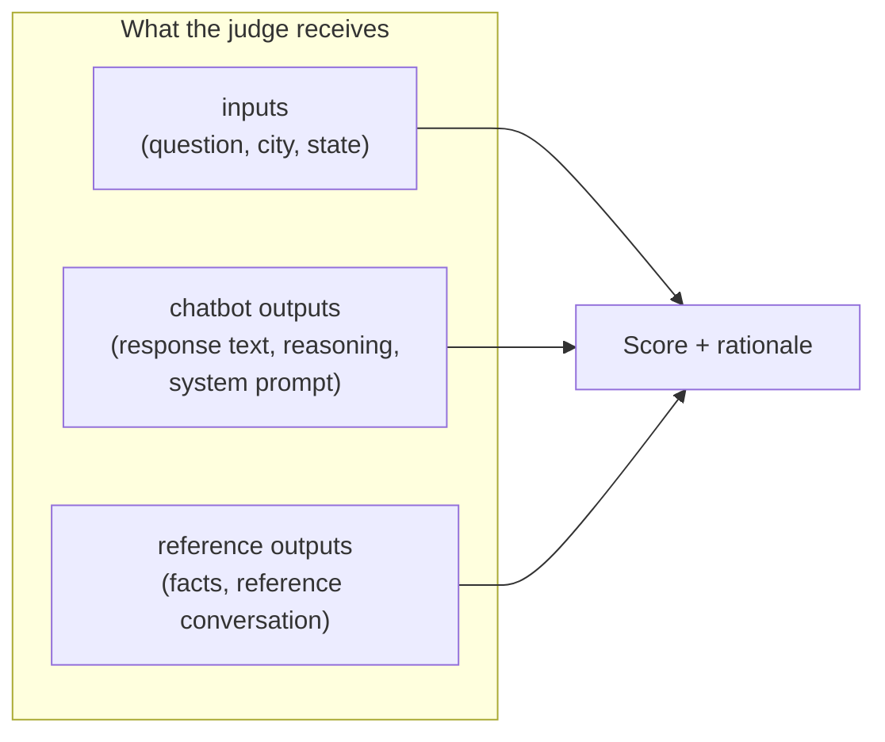

# Viewing & Comparing Results

Open https://smith.langchain.com/ → your dataset → **Experiments** tab.

From there you can:
- See per-example scores and the judge's written rationale for each score
- Compare two experiments side-by-side to measure the impact of a code or prompt change
- Filter to failing examples to understand where the chatbot struggles

## How the judge scores each example



The judge compares what the chatbot actually said against what it *should* have said, given the same question and context. The written rationale explains why a particular score was assigned — this is the most useful thing to read when a score surprises you.

## Comparing two experiments from the command line

```bash
uv run python -m evaluate.langsmith_dataset experiment compare \
  tfa-baseline tfa-my-experiment
```

---

**Backend contributors**: for score definitions and rubric calibration, see [Understanding Scores](15-understanding-scores.md).
