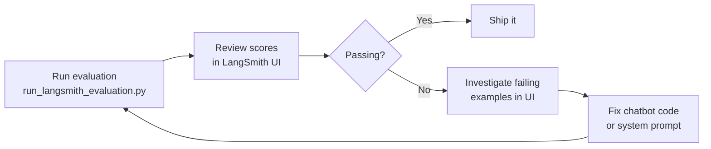
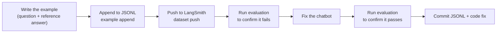
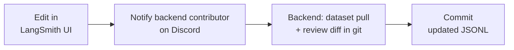

# Typical Workflows

## "I want to check quality before a release" (backend contributors)

## "I found a chatbot mistake and want to add a test for it"

**Content/frontend contributors**: follow [Contributing Test Examples](08-contributing-examples.md) to submit the example, then ask a backend contributor to run an evaluation.

**Backend contributors**:

## "I want to improve a reference answer using the browser editor" (all audiences)

## "I want to iterate on the system prompt"

**Legal contributors (browser)**: See [Cloud Studio](04-cloud-studio.md) and [Editing the System Prompt](09-system-prompt.md).

**Content/frontend contributors (local)**: See [Local Studio](07-local-studio.md) and [Editing the System Prompt](09-system-prompt.md).

---

**Next**: [Troubleshooting](17-troubleshooting.md)
